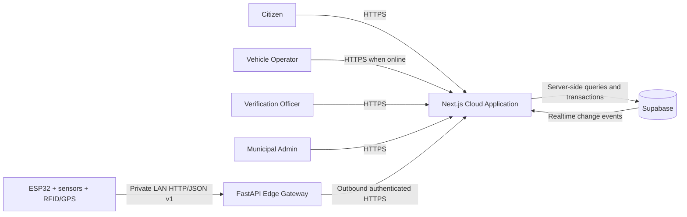
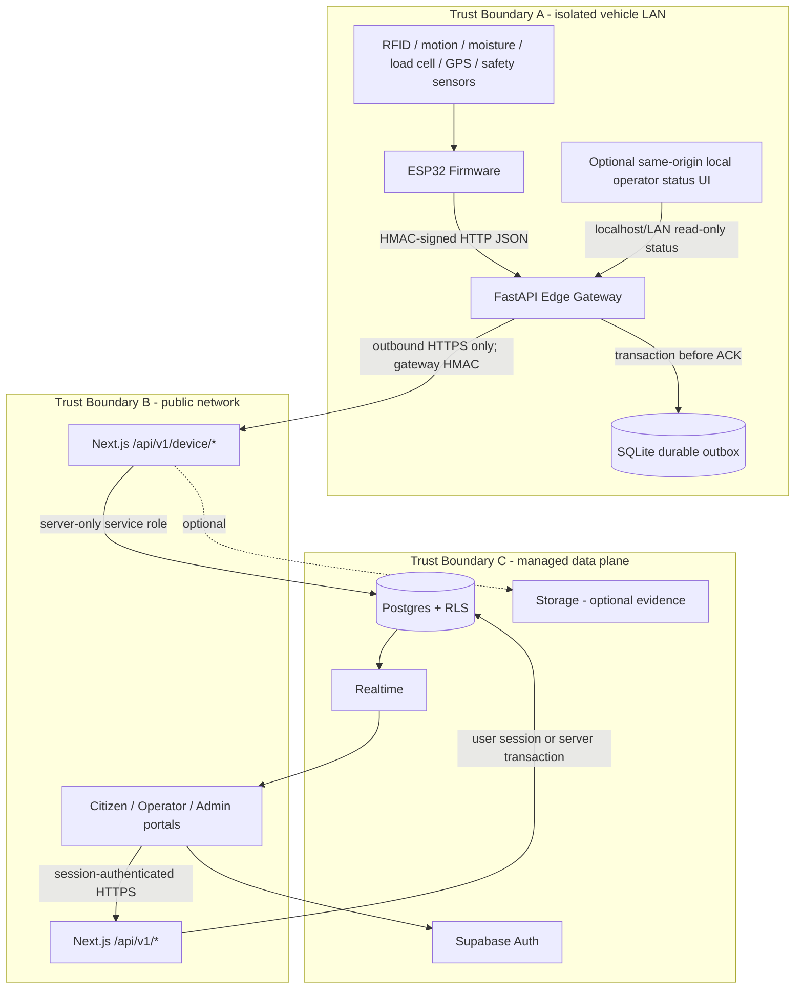
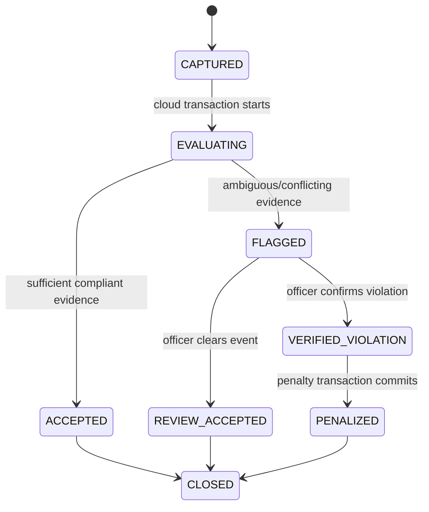
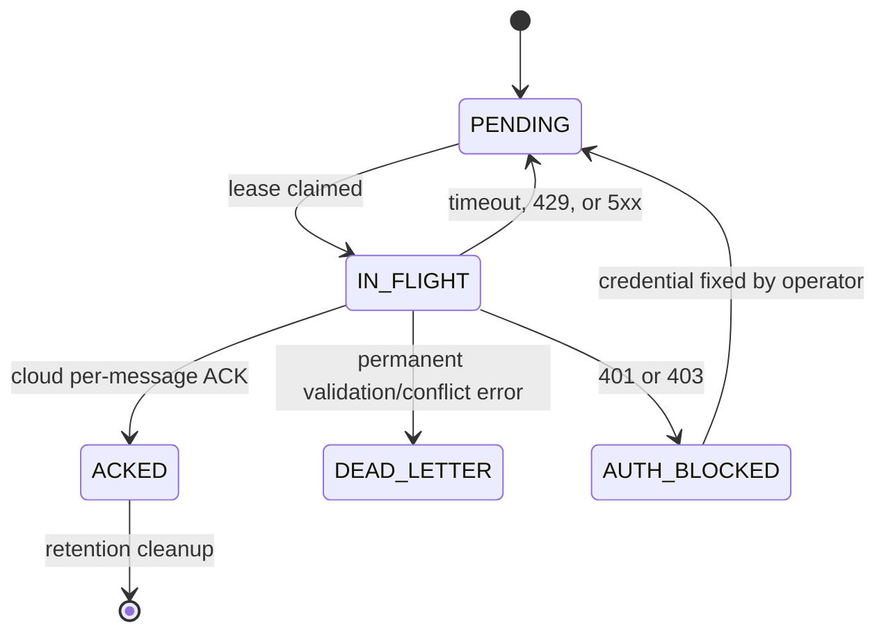
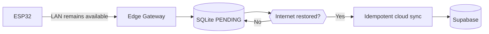

> **PLAN & STRUCTURE LOCK — v1.0:** This approved scope, stack, repository structure, contracts, ownership map, and delivery plan must not be changed by contributors or AI agents. Work only inside the assigned paths. If a change is necessary, stop and submit a `CHANGE_REQUEST`; only PARTH AJMERA may approve it, followed by an ADR and team notification.

# SGV 2.0 System Architecture

Status: Approved architecture baseline  
Architecture version: 1.0  
System: Smart Garbage Vehicle (SGV 2.0)  
Primary objective: demonstrate a complete, auditable flow from real ESP32 sensor capture to rewards, verified penalties, municipal analytics, and citizen visibility.

## 1. Architecture in one sentence

ESP32 devices send signed HTTP/JSON v1 messages over an isolated local Wi-Fi LAN to a FastAPI edge gateway; the gateway durably records each message in a SQLite outbox before acknowledging it, then synchronizes idempotently over authenticated HTTPS to versioned Next.js device APIs, which validate and transact against Supabase Postgres/Auth/Realtime for the citizen, operator, and municipal portals.

## 2. What is implemented versus documented

At the time this baseline was written, the workspace contains source PRDs, presentation material, and earlier planning documents but no application source, firmware, package manifest, database migration, or deployment configuration. Everything in this document is therefore the approved implementation target, not a claim that the components already exist.

The source material consistently requires:

- citizen identification through RFID, QR, or barcode;
- real sensor capture and GPS from the vehicle prototype;
- offline operation with later, duplicate-safe synchronization;
- sensor evidence treated as fallible, with human verification before a financial penalty;
- immutable reward/audit history;
- citizen, vehicle/operator, and municipal experiences;
- a backend and relational database supporting multiple devices, vehicles, and wards.

## 3. Fixed technology baseline

| Layer | Approved choice | Purpose |
|---|---|---|
| Vehicle controller | ESP32 firmware, C++/Arduino framework | Read RFID/QR adapter and sensors, normalize measurements, produce stable IDs, sign LAN requests |
| Local transport | HTTP/1.1 + JSON v1 on isolated WPA2/WPA3 LAN | Simple, debuggable ESP32-to-gateway link without dependence on public internet |
| Edge gateway | Python 3.12, FastAPI, Pydantic v2, Uvicorn | Authenticate devices, validate payloads, timestamp receipt, durably queue and synchronize |
| Edge persistence | SQLite in WAL mode with `synchronous=FULL` | Power-loss-safe outbox, replay protection, device state, and result cache |
| Cloud application | Next.js App Router + TypeScript strict mode | Citizen/admin/operator portals and server-only `/api/v1` route handlers |
| Cloud data platform | Supabase Postgres, Auth, Realtime, Storage if evidence files are enabled | Relational source of truth, RBAC/RLS, live updates, optional evidence storage |
| Styling/UI | Tailwind CSS and an accessible component layer | Rapid, consistent dashboards and mobile citizen experience |
| Maps | Leaflet + OpenStreetMap tiles | GPS visualization without a paid map API for the prototype |
| Validation/contracts | Pydantic at edge, Zod in Next.js, generated TypeScript types from Postgres | Validate every external boundary and keep contracts aligned |
| Testing | Pytest, Vitest, React Testing Library, Playwright, hardware-in-loop scripts | Unit, contract, integration, UI, offline, and real-device verification |
| Deployment | Edge on the local operator laptop/Raspberry Pi; Next.js on Vercel; Supabase managed | Local resilience plus a shareable cloud demo |

No ESP32 device connects directly to Supabase and no browser receives a Supabase service-role key.

## 4. System context



## 5. Container and trust-boundary view



### Trust rules

1. The vehicle LAN is private but not trusted. Every ESP32 request is signed and replay-protected.
2. Plain HTTP is permitted only inside the isolated LAN for the prototype. It must never be exposed through router port-forwarding.
3. The edge gateway makes outbound HTTPS calls; the cloud never initiates a connection into the vehicle LAN.
4. Gateway credentials and Supabase service credentials are different secrets with different scopes.
5. User authorization is enforced on the server and through Supabase RLS; hidden UI controls are not authorization.
6. Raw RFID values, secrets, citizen PII, and full request bodies must be redacted from logs.

## 6. Canonical repository boundaries

The detailed repository tree is governed by the master implementation plan. These are the architectural ownership boundaries that tree must preserve:

```text
apps/web/                     Next.js portals and /api/v1 server routes
  app/(citizen)/              Citizen credit, collection, bill, dispute, tracker UI
  app/(operator)/             Online operator/fleet UI
  app/(admin)/                Municipal dashboard and verification UI
  app/api/v1/                 User and device HTTP boundaries
  lib/domain/                 Business use cases; no React imports
  lib/rules-engine/           Pure, versioned compliance and reward rules
  lib/supabase/               Server/client adapters; service role server-only

services/edge-gateway/        FastAPI gateway, SQLite outbox, sync worker, local status
firmware/esp32/               Device drivers, measurement normalization, LAN client
packages/contracts/           JSON Schema/OpenAPI-derived shared v1 contracts
supabase/migrations/          Forward-only schema, constraints, RLS, seed data
tests/                        Cross-service contract, end-to-end, and HIL fixtures
DOCUMENTAION/                 Locked product and engineering documents
```

Dependency direction is inward:

```text
UI / firmware drivers / HTTP routes
              -> application use cases
              -> domain rules and contract types
              -> database, network, and hardware adapters
```

Domain logic must not import Next.js, FastAPI, SQLite, Supabase, sensor drivers, or UI code. The rules engine must be deterministic for a given input and ruleset version.

## 7. Component responsibilities

| Component | Owns | Must not own |
|---|---|---|
| ESP32 firmware | sensor reads, calibration application, local event ID, boot ID/sequence, request signature, bounded retry to edge | cloud credentials, citizen profile data, reward/penalty decisions |
| FastAPI edge | device authentication, schema validation, durable local ACK, replay detection, retry/backoff, cloud result cache, health status | final municipal truth, manual review, direct Supabase access |
| Next.js device API | gateway authentication, payload validation, idempotency claim, orchestration, rules evaluation, transactional writes | UI rendering logic, unvalidated raw payload use |
| Rules engine | score/evidence evaluation, accepted/flagged outcome, versioned explanation codes | network or DB calls, automatic financial penalty |
| Supabase Postgres | source-of-truth records, uniqueness, ledgers, RLS, audit constraints | edge buffering or firmware state |
| Citizen portal | own household history, points, bills, disputes, privacy-safe tracker | other households' records, raw device secrets/sensor diagnostics |
| Operator portal | assigned vehicle/run, minimal household confirmation, collection and device status | financial approval, unrestricted citizen PII |
| Admin portal | fleet, rulesets, analytics, verification, penalties, bill simulation, audits | bypassing API/domain invariants |
| Optional ML demo tool | synthetic-image inference and a validated observation artifact under `scripts/demo/ml/**` | device ingestion, autonomous decisions, direct database access, or any credit/penalty effect |

### Optional evidence sidecar

After the P0 vertical is green, a version-pinned Colab notebook may export a `MANUAL_COLAB` observation. An authenticated admin imports that JSON through the optional cloud route into `ml_observations`; the admin event view renders it beside, but never merges it into, canonical sensor/rule evidence. `RECORDED_ML` is the offline fallback. The core sequence below is unchanged and never waits for ML.

## 8. Core collection flow

```mermaid
sequenceDiagram
    autonumber
    participant S as Sensors/RFID
    participant E as ESP32
    participant G as FastAPI Edge
    participant Q as SQLite Outbox
    participant A as Next.js Device API
    participant R as Rules Engine
    participant D as Supabase
    participant P as Portals

    S->>E: Identifier + sensor snapshot + GPS
    E->>E: Generate eventId, bootId, sequence; sign request
    E->>G: POST /v1/ingest/collection-events
    G->>G: Verify signature, replay key, and JSON schema
    G->>Q: BEGIN IMMEDIATE; insert message + outbox; COMMIT
    G-->>E: 202 QUEUED_LOCALLY
    loop Until cloud acknowledges
        G->>A: POST /api/v1/device/sync (HTTPS, one signed message)
        A->>A: Verify gateway and atomically claim messageId
        A->>R: Evaluate against immutable ruleset version
        R-->>A: ACCEPTED or FLAGGED + reason codes
        A->>D: One transaction: event, readings, decision, reward if accepted, audit
        D-->>A: Commit/result
        A-->>G: Stable ACK and decision for the same messageId
        G->>Q: Mark ACKED and cache result
    end
    D-->>P: Realtime update / subsequent authenticated read
```

### Required behavior

- The ESP32 receives success only after the gateway commits locally, not merely after parsing JSON.
- `202 QUEUED_LOCALLY` means durable at edge, not yet stored in cloud.
- A duplicate `messageId` with the same payload hash replays the existing result.
- Reusing a `messageId` with a different payload is a `409 IDEMPOTENCY_CONFLICT` and is never silently accepted.
- Reward creation and event persistence occur in one cloud transaction and exactly once.
- A flag creates a verification case. It never creates a financial penalty by itself.

## 9. Orthogonal state models

Business state and transport state are separate. Never overload a business state such as `ACCEPTED` to mean “synced.”

### Collection decision lifecycle



Safety alerts such as fire, gas, or over-temperature are separate from segregation decisions. They can stop collection and raise an alert without implying citizen wrongdoing.

### Edge transport lifecycle



## 10. Rules and financial integrity

1. Sensors are evidence, not proof. Moisture alone cannot produce a penalty.
2. The cloud records the exact `rulesetVersion` and explanation codes used for every evaluation.
3. `ACCEPTED` may create one reward credit. A database unique constraint prevents duplicate credit.
4. `FLAGGED` freezes reward/penalty action until review.
5. A penalty requires a recorded `VERIFIED_VIOLATION` decision by an authorized officer.
6. Reward, penalty, redemption, bill, and manual adjustment entries are append-only and audited.
7. Money is stored as integer paise; weights use decimal kilograms; timestamps use UTC RFC 3339.

## 11. Realtime model

Supabase Realtime is for presentation freshness, not correctness. Each portal must perform an initial authorized query, subscribe to the smallest permitted table/topic, and refetch after reconnect.

| Event | Consumer | Data exposed |
|---|---|---|
| vehicle latest-location upsert | citizen/admin maps | citizen receives approximate/assigned vehicle only; admin receives authorized fleet data |
| collection decision change | citizen/operator | event ID, public status, points; no raw secret or unnecessary sensor detail |
| verification case created | verification/admin | case ID, evidence summary, queue count |
| reward ledger insert | citizen portal | points and source event for own household |
| safety alert opened | operator/admin | vehicle, severity, code, timestamps |

If Realtime is unavailable, polling the same versioned REST read endpoints must preserve all functionality.

## 12. Deployment topology

### Demo/uni-level deployment

- ESP32 and gateway laptop/Raspberry Pi join a dedicated hotspot or isolated router.
- FastAPI binds to the LAN interface on a fixed address/hostname such as `sgv-edge.local:8080`.
- SQLite lives on persistent local storage, not `/tmp`.
- Gateway calls the Vercel-hosted Next.js device API over HTTPS.
- Next.js uses server-only Supabase credentials for device ingestion and scoped user sessions for portals.
- Supabase is the authoritative cloud database, Auth provider, and Realtime publisher.

### Offline behavior



Collection must continue while the WAN is down as long as the LAN gateway is available. The operator sees local pending count and oldest-pending age. Cloud portals show the last known state as stale, never as current.

## 13. Failure handling

| Failure | Expected behavior | Recovery evidence |
|---|---|---|
| ESP32 cannot reach edge | device retries with bounded exponential backoff and keeps the stable message ID | device display/serial error and retry count |
| Edge loses internet | local insert and `202` continue; sync queue grows | `/healthz` reports cloud offline, pending count, oldest age |
| Edge restarts after ACK to device | SQLite row remains `PENDING` or leased row becomes eligible after lease expiry | message eventually syncs once |
| Cloud times out after commit | edge retries same idempotency key; cloud returns stored result | no duplicate event/reward |
| Invalid device payload | edge returns `422`; device does not invent values; operator can inspect error | rejected-message metric without raw PII |
| Bad gateway credential | sync enters `AUTH_BLOCKED`; no rapid retry storm | visible critical alert; operator rotates/fixes credential |
| Sensor unavailable | measurement quality is `MISSING/DEGRADED`; rules flag or use configured degraded policy | sensor health and reason code stored |
| GPS unavailable | event is accepted with `locationQuality=UNAVAILABLE` if policy permits | no fabricated `0,0` coordinates |
| Realtime outage | portals refetch/poll | source-of-truth REST remains correct |

## 14. Non-functional targets for the prototype

| Quality | Target |
|---|---|
| Edge durable ACK | p95 under 250 ms on the local LAN |
| Common cloud API read | p95 under 500 ms under demo load |
| Online collection decision | normally visible within 2 seconds after edge sync |
| Active GPS publish interval | configurable, default 10 seconds |
| Device heartbeat | configurable, default 30 seconds |
| Offline durability | survive gateway process restart and WAN loss without duplicate cloud effects |
| Queue capacity | at least 24 hours of expected demo traffic with 50% free disk headroom |
| Accessibility | keyboard-operable critical flows, labeled inputs, non-color-only status, WCAG AA contrast target |
| Observability | request ID, message ID, gateway/device ID, queue depth, sync lag, error code; no secrets/PII |

## 15. Architectural acceptance gates

The architecture is not considered integrated until all are demonstrated:

1. A real ESP32 produces at least RFID/identifier plus two real sensor readings.
2. Disconnecting WAN does not stop LAN ingestion; queue depth increases.
3. Restarting FastAPI does not lose an already acknowledged edge message.
4. Reconnecting WAN drains the queue without duplicate events or points.
5. Replaying the same message returns the existing result.
6. Replaying the same ID with a changed body returns `409`.
7. A compliant submission awards points exactly once.
8. A conflicting submission creates a verification case and no penalty.
9. Only an authorized review decision can create a penalty.
10. A citizen cannot read another household's collections, rewards, penalties, bills, or disputes.
11. Cloud/device credentials never appear in browser bundles, firmware source, logs, or Git history.
12. GPS stale/offline state is explicit in both operator and admin views.

## 16. Configuration decisions still to confirm

These values can be finalized without changing the architecture. Use the stated default until PARTH AJMERA records a different approved value:

| Parameter | Default |
|---|---|
| Prototype categories | `WET`, `DRY`, `REJECT` |
| Identity input | RFID, with QR/manual token fallback |
| Minimum real sensors | intake/motion, moisture, load cell; GPS if available |
| Edge host/port | `sgv-edge.local:8080` |
| GPS publish interval | 10 seconds while active |
| Heartbeat interval | 30 seconds |
| Citizen location precision | approximate/assigned vehicle, not unrestricted fleet history |
| Billing | simulated municipal bill; no real payment rail |
| Reward redemption | points workflow only unless a separately approved provider integration exists |
| Evidence images | disabled in MVP |

Any change that introduces a different transport, cloud backend, database, repository boundary, automatic penalty, payment provider, or computer-vision scope beyond the optional observation-only path in `21_ML_INTEGRATION.md` is architectural and requires the locked change-control process.

## 17. Related implementation contracts

- `05_DATA_SCHEMA.md` is authoritative for entities, constraints, RLS, and ledger invariants.
- `06_API_IOT_CONTRACT.md` is authoritative for JSON, authentication, errors, idempotency, and endpoint behavior.
- `08_EDGE_GATEWAY.md` is authoritative for SQLite durability, retry, operations, and local deployment.
