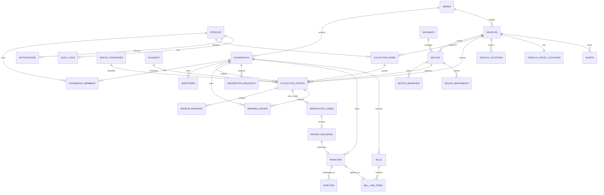

> **PLAN & STRUCTURE LOCK — v1.0:** This approved scope, stack, repository structure, contracts, ownership map, and delivery plan must not be changed by contributors or AI agents. Work only inside the assigned paths. If a change is necessary, stop and submit a `CHANGE_REQUEST`; only PARTH AJMERA may approve it, followed by an ADR and team notification.

# SGV 2.0 Data Schema and Integrity Contract

Schema version: 1.0  
Database: Supabase PostgreSQL  
Authority: this document defines the cloud source-of-truth model; `08_EDGE_GATEWAY.md` defines the separate edge SQLite schema.

## 1. Data-design rules

1. Postgres is the authoritative record after synchronization. SQLite is a durable transport outbox, not a second business database.
2. IDs are UUIDs generated by the initiating system. A device-created ID is preserved end to end.
3. All timestamps are `timestamptz` in UTC. Device time and server receipt time are stored separately.
4. Money is integer paise (`bigint`), never floating-point rupees. Reward points are signed integers.
5. Sensor values use explicit units and quality metadata. Missing data is `NULL`/`MISSING`, never a fabricated zero.
6. Raw RFID/QR values are not stored. Store a server-peppered HMAC lookup hash plus a safe display suffix.
7. Device messages, reward entries, review decisions, penalties, bill lines, and audit records are append-only after finalization.
8. A reward is exactly once per qualifying event. A penalty is impossible without an authorized verified-violation decision.
9. Business decision state and synchronization state are different fields/tables.
10. JSONB is allowed for variable raw evidence and audit metadata, but frequently queried fields remain typed columns.

## 2. Entity relationship model



## 3. Table catalog

| Table | Purpose | Mutability |
|---|---|---|
| `wards` | Municipal ward/zone reference | admin-managed |
| `profiles` | Supabase Auth extension and trusted app role | restricted |
| `households` | Municipal household account | soft status changes only |
| `household_members` | Many-to-many user/household authorization link | restricted |
| `identifiers` | RFID/QR/barcode assignments using lookup hashes | assignment lifecycle |
| `vehicles` | Fleet identity, assignment, and operating status | operational |
| `gateways` | Registered FastAPI edge instances | system-admin only |
| `devices` | ESP32 identity, firmware and credential status | system-admin/heartbeat |
| `collection_runs` | One operator/vehicle route or shift | state transition |
| `waste_categories` | Configurable category catalog | additive/disable |
| `device_messages` | Cloud idempotency claim and processing result | append plus processing result |
| `collection_events` | Core household waste submission | controlled state transition |
| `sensor_readings` | Normalized evidence measurements | append-only |
| `ml_observations` | Optional provenance-labelled, non-decisional ML evidence | append-only |
| `rulesets` | Immutable versioned rule configuration | draft then publish/freeze |
| `verification_cases` | Human review queue for flagged events | controlled state transition |
| `review_decisions` | Officer decision and explanation | append-only |
| `reward_ledger` | Every point credit/debit/adjustment | append-only |
| `redemption_requests` | Reward redemption workflow | controlled state transition |
| `penalties` | Verified financial consequence | append/reversal status only |
| `disputes` | Citizen appeal workflow | controlled state transition |
| `bills` | Simulated municipal billing period | draft then issue/freeze |
| `bill_line_items` | Explicit base/penalty/adjustment lines | append-only after issue |
| `vehicle_locations` | GPS history | append-only, retention-managed |
| `vehicle_latest_locations` | One current map row per vehicle | upsert cache |
| `device_heartbeats` | Device health history | append-only, retention-managed |
| `alerts` | Safety, fill, connectivity, and device incidents | lifecycle |
| `notifications` | In-app user/admin notifications | append/read status |
| `audit_logs` | Security and administrative audit trail | append-only |

## 4. Core SQL shape

The migration owner may split this DDL into ordered migration files, but must preserve names, constraints, and invariants.

### 4.1 Identity and municipal structure

```sql
create extension if not exists pgcrypto;

create table public.wards (
  id uuid primary key default gen_random_uuid(),
  code text not null unique,
  name text not null,
  zone text,
  is_active boolean not null default true,
  created_at timestamptz not null default now(),
  updated_at timestamptz not null default now()
);

create table public.profiles (
  id uuid primary key references auth.users(id) on delete restrict,
  app_role text not null check (app_role in (
    'CITIZEN', 'OPERATOR', 'VERIFICATION_OFFICER', 'MUNICIPAL_ADMIN', 'SYSTEM_ADMIN'
  )),
  display_name text not null,
  phone text,
  is_active boolean not null default true,
  created_at timestamptz not null default now(),
  updated_at timestamptz not null default now()
);

create table public.households (
  id uuid primary key default gen_random_uuid(),
  household_code text not null unique,
  ward_id uuid not null references public.wards(id),
  address_line text not null,
  status text not null default 'ACTIVE'
    check (status in ('ACTIVE', 'SUSPENDED', 'INACTIVE')),
  created_at timestamptz not null default now(),
  updated_at timestamptz not null default now()
);

create table public.household_members (
  household_id uuid not null references public.households(id) on delete restrict,
  profile_id uuid not null references public.profiles(id) on delete restrict,
  member_role text not null default 'PRIMARY'
    check (member_role in ('PRIMARY', 'MEMBER')),
  status text not null default 'ACTIVE'
    check (status in ('ACTIVE', 'INACTIVE')),
  joined_at timestamptz not null default now(),
  primary key (household_id, profile_id)
);

create table public.identifiers (
  id uuid primary key default gen_random_uuid(),
  household_id uuid not null references public.households(id) on delete restrict,
  identifier_type text not null check (identifier_type in ('RFID', 'QR', 'BARCODE')),
  lookup_hash text not null unique check (lookup_hash ~ '^[0-9a-f]{64}$'),
  display_suffix text not null check (char_length(display_suffix) between 2 and 8),
  status text not null default 'ACTIVE'
    check (status in ('ACTIVE', 'SUSPENDED', 'LOST', 'REPLACED', 'REVOKED')),
  assigned_at timestamptz not null default now(),
  revoked_at timestamptz,
  created_by uuid references public.profiles(id),
  check ((status in ('ACTIVE', 'SUSPENDED', 'LOST')) or revoked_at is not null)
);

create unique index one_active_identifier_per_type
  on public.identifiers (household_id, identifier_type)
  where status = 'ACTIVE';
```

`lookup_hash` is `hex(HMAC-SHA256(server_pepper, normalized_identifier))`. The pepper exists only in server secret storage. Never put it in Postgres, firmware, browser code, seed files, or logs.

### 4.2 Vehicles, gateways, devices, and runs

```sql
create table public.vehicles (
  id uuid primary key default gen_random_uuid(),
  vehicle_code text not null unique,
  registration_number text unique,
  ward_id uuid references public.wards(id),
  status text not null default 'IDLE'
    check (status in ('IDLE', 'COLLECTING', 'MOVING_TO_FACILITY', 'RETURNING', 'MAINTENANCE', 'OFFLINE')),
  created_at timestamptz not null default now(),
  updated_at timestamptz not null default now()
);

create table public.gateways (
  id uuid primary key default gen_random_uuid(),
  gateway_code text not null unique,
  vehicle_id uuid references public.vehicles(id),
  credential_version integer not null default 1 check (credential_version > 0),
  status text not null default 'ACTIVE'
    check (status in ('ACTIVE', 'SUSPENDED', 'REVOKED')),
  last_seen_at timestamptz,
  created_at timestamptz not null default now()
);

create table public.devices (
  id uuid primary key default gen_random_uuid(),
  device_code text not null unique,
  gateway_id uuid not null references public.gateways(id),
  vehicle_id uuid not null references public.vehicles(id),
  device_type text not null default 'ESP32',
  firmware_version text,
  credential_version integer not null default 1 check (credential_version > 0),
  status text not null default 'ACTIVE'
    check (status in ('PROVISIONING', 'ACTIVE', 'DEGRADED', 'SUSPENDED', 'REVOKED')),
  created_at timestamptz not null default now(),
  updated_at timestamptz not null default now()
);

create table public.collection_runs (
  id uuid primary key default gen_random_uuid(),
  vehicle_id uuid not null references public.vehicles(id),
  operator_id uuid not null references public.profiles(id),
  ward_id uuid references public.wards(id),
  status text not null default 'PLANNED'
    check (status in ('PLANNED', 'ACTIVE', 'PAUSED', 'COMPLETED', 'CANCELLED')),
  started_at timestamptz,
  completed_at timestamptz,
  created_at timestamptz not null default now(),
  check (completed_at is null or started_at is not null),
  check (completed_at is null or completed_at >= started_at)
);
```

Secrets are not stored in these rows. Store only secret versions/status; actual gateway/device keys live in Vercel secret storage and the protected edge/ESP32 provisioning stores.

### 4.3 Cloud idempotency and ingestion evidence

```sql
create table public.device_messages (
  message_id uuid primary key,
  gateway_id uuid not null references public.gateways(id),
  device_id uuid not null references public.devices(id),
  boot_id uuid not null,
  sequence_no bigint not null check (sequence_no >= 0),
  message_type text not null check (message_type in (
    'COLLECTION_EVENT_V1', 'GPS_V1', 'HEARTBEAT_V1', 'TELEMETRY_V1'
  )),
  schema_version text not null check (schema_version = '1.0'),
  payload_hash text not null check (payload_hash ~ '^[0-9a-f]{64}$'),
  occurred_at timestamptz,
  received_at timestamptz not null default now(),
  processing_status text not null default 'RECEIVED'
    check (processing_status in ('RECEIVED', 'PROCESSED', 'REJECTED')),
  result_code text,
  result_json jsonb,
  processed_at timestamptz,
  unique (device_id, boot_id, sequence_no)
);

create index device_messages_received_idx
  on public.device_messages (received_at desc);
create index device_messages_unprocessed_idx
  on public.device_messages (processing_status, received_at)
  where processing_status = 'RECEIVED';
```

Atomic claim rule:

- insert `message_id` before any business side effect;
- if the same ID and same `payload_hash` exists, return its stored result;
- if the same ID has a different hash, return `IDEMPOTENCY_CONFLICT`;
- never implement this as `SELECT` followed by an unprotected `INSERT`.

### 4.4 Rules, collection events, and readings

```sql
create table public.waste_categories (
  id uuid primary key default gen_random_uuid(),
  code text not null unique,
  name text not null,
  is_active boolean not null default true,
  sort_order integer not null default 0
);

create table public.rulesets (
  id uuid primary key default gen_random_uuid(),
  version text not null unique,
  status text not null default 'DRAFT'
    check (status in ('DRAFT', 'PUBLISHED', 'RETIRED')),
  config jsonb not null,
  config_hash text not null check (config_hash ~ '^[0-9a-f]{64}$'),
  created_by uuid not null references public.profiles(id),
  created_at timestamptz not null default now(),
  published_at timestamptz,
  check ((status = 'DRAFT' and published_at is null) or
         (status in ('PUBLISHED', 'RETIRED') and published_at is not null))
);

create unique index one_published_ruleset
  on public.rulesets ((status)) where status = 'PUBLISHED';

create table public.collection_events (
  id uuid primary key,
  external_event_id uuid not null,
  source_message_id uuid not null unique references public.device_messages(message_id),
  household_id uuid not null references public.households(id),
  identifier_id uuid references public.identifiers(id),
  vehicle_id uuid not null references public.vehicles(id),
  device_id uuid not null references public.devices(id),
  run_id uuid references public.collection_runs(id),
  operator_id uuid references public.profiles(id),
  category_id uuid not null references public.waste_categories(id),
  event_state text not null default 'CAPTURED'
    check (event_state in ('CAPTURED', 'EVALUATING', 'ACCEPTED', 'FLAGGED',
                           'REVIEW_ACCEPTED', 'VERIFIED_VIOLATION', 'PENALIZED', 'CLOSED')),
  compliance_score numeric(5,2) check (compliance_score between 0 and 100),
  ruleset_id uuid references public.rulesets(id),
  explanation_codes text[] not null default '{}',
  weight_kg numeric(10,3) check (weight_kg is null or weight_kg between 0 and 500),
  latitude numeric(9,6) check (latitude is null or latitude between -90 and 90),
  longitude numeric(9,6) check (longitude is null or longitude between -180 and 180),
  location_accuracy_m numeric(10,2) check (location_accuracy_m is null or location_accuracy_m >= 0),
  time_quality text not null default 'UNKNOWN'
    check (time_quality in ('GPS', 'RTC', 'GATEWAY', 'UNKNOWN')),
  occurred_at timestamptz,
  received_at timestamptz not null,
  evaluated_at timestamptz,
  raw_evidence jsonb not null,
  created_at timestamptz not null default now(),
  updated_at timestamptz not null default now(),
  unique (device_id, external_event_id)
);

create table public.sensor_readings (
  id uuid primary key default gen_random_uuid(),
  event_id uuid not null references public.collection_events(id) on delete restrict,
  sensor_code text not null,
  sequence_no integer not null default 0 check (sequence_no >= 0),
  numeric_value numeric,
  boolean_value boolean,
  text_value text,
  unit text not null,
  quality text not null default 'GOOD'
    check (quality in ('GOOD', 'ESTIMATED', 'DEGRADED', 'MISSING', 'OUT_OF_RANGE')),
  captured_at timestamptz,
  calibration_version text,
  created_at timestamptz not null default now(),
  check (num_nonnulls(numeric_value, boolean_value, text_value) = 1),
  unique (event_id, sensor_code, sequence_no)
);

create index collection_events_household_time_idx
  on public.collection_events (household_id, occurred_at desc);
create index collection_events_vehicle_time_idx
  on public.collection_events (vehicle_id, occurred_at desc);
create index collection_events_flagged_idx
  on public.collection_events (created_at)
  where event_state = 'FLAGGED';
create index sensor_readings_event_idx
  on public.sensor_readings (event_id, sensor_code);
```

Optional P1 evidence table:

```sql
create table public.ml_observations (
  id uuid primary key,
  event_id uuid not null references public.collection_events(id) on delete restrict,
  source text not null check (source in ('MANUAL_COLAB', 'RECORDED_ML')),
  model_family text not null,
  model_version text not null,
  weights_sha256 text not null check (weights_sha256 ~ '^[0-9a-f]{64}$'),
  input_sha256 text not null check (input_sha256 ~ '^[0-9a-f]{64}$'),
  payload_hash text not null check (payload_hash ~ '^[0-9a-f]{64}$'),
  detected_label text not null check (length(detected_label) between 1 and 80),
  predicted_category text not null check (predicted_category in ('WET', 'DRY', 'REJECT', 'UNKNOWN')),
  confidence numeric(6,5) not null check (confidence between 0 and 1),
  inference_ms integer check (inference_ms is null or inference_ms between 0 and 600000),
  observed_at timestamptz not null,
  created_by uuid not null references public.profiles(id),
  created_at timestamptz not null default now(),
  unique (event_id, input_sha256, model_version)
);

create index ml_observations_event_idx
  on public.ml_observations (event_id, created_at desc);
```

This table accepts structured metadata only—no raw/base64 image, URL fetch, PII, or secret. Inserts are server-controlled and admin-only; observations are never inputs to event-state, reward-ledger, or penalty mutations.

Published `rulesets.config` is immutable. A change creates a new version, preserving historical explainability.

### 4.5 Human verification, rewards, and penalties

```sql
create table public.verification_cases (
  id uuid primary key default gen_random_uuid(),
  event_id uuid not null unique references public.collection_events(id),
  status text not null default 'OPEN'
    check (status in ('OPEN', 'ASSIGNED', 'DECIDED', 'CANCELLED')),
  reason_codes text[] not null,
  assigned_to uuid references public.profiles(id),
  opened_at timestamptz not null default now(),
  decided_at timestamptz
);

create table public.review_decisions (
  id uuid primary key default gen_random_uuid(),
  case_id uuid not null unique references public.verification_cases(id),
  officer_id uuid not null references public.profiles(id),
  decision text not null check (decision in ('ACCEPTED', 'VERIFIED_VIOLATION')),
  reason_code text not null,
  notes text,
  decided_at timestamptz not null default now()
);

create table public.reward_ledger (
  id uuid primary key default gen_random_uuid(),
  household_id uuid not null references public.households(id),
  source_event_id uuid references public.collection_events(id),
  redemption_request_id uuid,
  entry_kind text not null check (entry_kind in (
    'COLLECTION_REWARD', 'BONUS', 'REDEMPTION_DEBIT', 'REVERSAL', 'ADMIN_ADJUSTMENT'
  )),
  points_delta integer not null check (points_delta <> 0),
  reason_code text not null,
  created_by uuid references public.profiles(id),
  created_at timestamptz not null default now(),
  metadata jsonb not null default '{}'
);

create unique index one_collection_reward_per_event
  on public.reward_ledger (source_event_id)
  where entry_kind = 'COLLECTION_REWARD';

create table public.redemption_requests (
  id uuid primary key default gen_random_uuid(),
  household_id uuid not null references public.households(id),
  requested_by uuid not null references public.profiles(id),
  points integer not null check (points > 0),
  status text not null default 'REQUESTED'
    check (status in ('REQUESTED', 'APPROVED', 'REJECTED', 'COMPLETED', 'FAILED', 'CANCELLED')),
  idempotency_key text not null,
  requested_at timestamptz not null default now(),
  updated_at timestamptz not null default now(),
  unique (requested_by, idempotency_key)
);

alter table public.reward_ledger
  add constraint reward_redemption_fk
  foreign key (redemption_request_id)
  references public.redemption_requests(id);

create table public.penalties (
  id uuid primary key default gen_random_uuid(),
  household_id uuid not null references public.households(id),
  event_id uuid not null unique references public.collection_events(id),
  verification_decision_id uuid not null unique references public.review_decisions(id),
  amount_paise bigint not null check (amount_paise > 0),
  reason_code text not null,
  status text not null default 'PENDING_BILL'
    check (status in ('PENDING_BILL', 'BILLED', 'DISPUTED', 'WAIVED', 'PAID')),
  created_at timestamptz not null default now(),
  waived_at timestamptz,
  waived_by uuid references public.profiles(id),
  waiver_reason text
);

create table public.disputes (
  id uuid primary key default gen_random_uuid(),
  penalty_id uuid not null references public.penalties(id),
  household_id uuid not null references public.households(id),
  submitted_by uuid not null references public.profiles(id),
  reason text not null,
  status text not null default 'OPEN'
    check (status in ('OPEN', 'UNDER_REVIEW', 'UPHELD', 'ACCEPTED', 'CLOSED')),
  resolution text,
  idempotency_key text not null,
  created_at timestamptz not null default now(),
  resolved_at timestamptz,
  unique (submitted_by, idempotency_key)
);
```

Database functions/triggers must reject a penalty unless its referenced review decision is `VERIFIED_VIOLATION` and the officer had an active verification/admin role at decision time. Application checks alone are insufficient.

Reward balance is derived, never hand-edited:

```sql
create view public.reward_balances as
select household_id, coalesce(sum(points_delta), 0)::bigint as points_balance
from public.reward_ledger
group by household_id;
```

The redemption transaction locks the household's ledger/balance scope, verifies sufficient points, inserts the request and debit once, then commits. A balance must never go negative.

### 4.6 Billing

```sql
create table public.bills (
  id uuid primary key default gen_random_uuid(),
  household_id uuid not null references public.households(id),
  period_start date not null,
  period_end date not null,
  status text not null default 'DRAFT'
    check (status in ('DRAFT', 'ISSUED', 'PAID', 'VOID')),
  issued_at timestamptz,
  due_at timestamptz,
  created_at timestamptz not null default now(),
  check (period_end >= period_start),
  unique (household_id, period_start, period_end)
);

create table public.bill_line_items (
  id uuid primary key default gen_random_uuid(),
  bill_id uuid not null references public.bills(id),
  penalty_id uuid unique references public.penalties(id),
  line_type text not null check (line_type in ('BASE_CHARGE', 'PENALTY', 'ADJUSTMENT', 'CREDIT')),
  description text not null,
  amount_paise bigint not null,
  created_at timestamptz not null default now(),
  check ((line_type = 'PENALTY' and penalty_id is not null) or
         (line_type <> 'PENALTY'))
);

create view public.bill_totals as
select b.id as bill_id, coalesce(sum(li.amount_paise), 0)::bigint as total_paise
from public.bills b
left join public.bill_line_items li on li.bill_id = b.id
group by b.id;
```

Issued bills and their line items are immutable. Corrections use an adjustment/reversal line or a new bill state; never rewrite financial history.

### 4.7 GPS, device health, alerts, notifications, and audit

```sql
create table public.vehicle_locations (
  id uuid primary key default gen_random_uuid(),
  source_message_id uuid not null unique references public.device_messages(message_id),
  vehicle_id uuid not null references public.vehicles(id),
  device_id uuid not null references public.devices(id),
  latitude numeric(9,6) not null check (latitude between -90 and 90),
  longitude numeric(9,6) not null check (longitude between -180 and 180),
  accuracy_m numeric(10,2) check (accuracy_m is null or accuracy_m >= 0),
  speed_kph numeric(8,2) check (speed_kph is null or speed_kph >= 0),
  heading_deg numeric(6,2) check (heading_deg is null or heading_deg between 0 and 360),
  captured_at timestamptz,
  received_at timestamptz not null default now(),
  time_quality text not null check (time_quality in ('GPS', 'RTC', 'GATEWAY', 'UNKNOWN'))
);

create table public.vehicle_latest_locations (
  vehicle_id uuid primary key references public.vehicles(id),
  location_id uuid not null unique references public.vehicle_locations(id),
  latitude numeric(9,6) not null,
  longitude numeric(9,6) not null,
  accuracy_m numeric(10,2),
  captured_at timestamptz,
  received_at timestamptz not null,
  is_stale boolean not null default false
);

create table public.device_heartbeats (
  id uuid primary key default gen_random_uuid(),
  source_message_id uuid not null unique references public.device_messages(message_id),
  device_id uuid not null references public.devices(id),
  firmware_version text,
  uptime_seconds bigint check (uptime_seconds is null or uptime_seconds >= 0),
  free_heap_bytes bigint check (free_heap_bytes is null or free_heap_bytes >= 0),
  wifi_rssi_dbm integer,
  sensor_health jsonb not null default '{}',
  captured_at timestamptz,
  received_at timestamptz not null default now()
);

create table public.alerts (
  id uuid primary key default gen_random_uuid(),
  vehicle_id uuid references public.vehicles(id),
  device_id uuid references public.devices(id),
  event_id uuid references public.collection_events(id),
  alert_code text not null,
  severity text not null check (severity in ('INFO', 'WARNING', 'CRITICAL')),
  status text not null default 'OPEN' check (status in ('OPEN', 'ACKNOWLEDGED', 'RESOLVED')),
  details jsonb not null default '{}',
  opened_at timestamptz not null default now(),
  acknowledged_at timestamptz,
  resolved_at timestamptz
);

create table public.notifications (
  id uuid primary key default gen_random_uuid(),
  profile_id uuid not null references public.profiles(id),
  notification_type text not null,
  title text not null,
  body text not null,
  entity_type text,
  entity_id uuid,
  read_at timestamptz,
  created_at timestamptz not null default now()
);

create table public.audit_logs (
  id uuid primary key default gen_random_uuid(),
  actor_type text not null check (actor_type in ('USER', 'GATEWAY', 'DEVICE', 'SYSTEM')),
  actor_id uuid,
  action text not null,
  entity_type text not null,
  entity_id uuid,
  request_id uuid,
  before_data jsonb,
  after_data jsonb,
  metadata jsonb not null default '{}',
  created_at timestamptz not null default now()
);

create index vehicle_locations_vehicle_time_idx
  on public.vehicle_locations (vehicle_id, received_at desc);
create index heartbeats_device_time_idx
  on public.device_heartbeats (device_id, received_at desc);
create index alerts_open_idx
  on public.alerts (severity, opened_at desc) where status = 'OPEN';
create index notifications_unread_idx
  on public.notifications (profile_id, created_at desc) where read_at is null;
create index audit_entity_idx
  on public.audit_logs (entity_type, entity_id, created_at desc);
```

## 5. Transaction boundaries

The following operations must each run as one Postgres transaction, preferably through server-only SQL/RPC functions called by Next.js:

### `ingest_device_message_v1`

1. Claim `device_messages.message_id` with its payload hash.
2. Resolve gateway/device status and vehicle binding.
3. Insert the typed business record and normalized readings/location/heartbeat.
4. For a collection, evaluate using one published ruleset version.
5. Insert reward and audit entries if accepted, or verification case if flagged.
6. Store the stable response in `device_messages.result_json` and mark `PROCESSED`.
7. Commit; only then return the per-message ACK.

### `record_review_decision_v1`

1. Lock the open verification case.
2. Verify active officer role and absence of an existing final decision.
3. Insert `review_decisions`.
4. Transition event/case state.
5. If verified violation, insert one penalty; otherwise apply the configured accepted-event reward policy at most once.
6. Insert audit and notification rows.
7. Commit.

### `request_redemption_v1`

1. Atomically claim caller idempotency key.
2. Verify membership, active account, and available ledger balance.
3. Insert request and exactly one debit/reservation entry according to the approved redemption policy.
4. Insert audit/notification.
5. Commit.

## 6. Row-Level Security matrix

Enable RLS on every table exposed through Supabase. Service-role ingestion is allowed only inside server-side Next.js code after gateway verification.

| Resource | Citizen | Operator | Verification officer | Municipal admin | System/device path |
|---|---|---|---|---|---|
| household/profile | own linked household, minimum fields | minimum confirmation for active collection | evidence-safe identity | authorized municipality | server ingestion lookup only |
| collection event | own household | assigned run/vehicle | flagged case | all authorized wards | insert through server transaction |
| sensor readings | privacy-safe own summary | assigned vehicle | evidence for assigned/open case | authorized access | insert through server transaction |
| reward ledger | own household read | no financial mutation | read if case requires | read/authorized adjustment via API | transactional insert only |
| penalties/bills/disputes | own household | none | case-related read | authorized workflow | no device access |
| GPS | assigned approximate vehicle | assigned vehicle | not needed by default | fleet access | insert through server transaction |
| rulesets | published read where needed | published config | published config | draft/publish via API | device config projection only |
| credentials/messages/audit | none | health summary only | none | audit summary | system admin/server only |

Example ownership predicate for citizen reads:

```sql
exists (
  select 1
  from public.household_members hm
  where hm.household_id = collection_events.household_id
    and hm.profile_id = auth.uid()
    and hm.status = 'ACTIVE'
)
```

Critical RLS rules:

- clients cannot update their own `profiles.app_role`;
- clients cannot insert/update/delete reward ledger, review decision, penalty, bill line, device message, or audit rows directly;
- operators cannot query arbitrary RFID identifiers or household lists;
- an inactive user, identifier, gateway, or device fails closed;
- Storage evidence buckets, if enabled later, use signed URLs and case/household policies rather than public objects.

## 7. API-to-database invariants

| Invariant | Database enforcement |
|---|---|
| same device message has one effect | `device_messages.message_id` primary key + payload hash comparison |
| boot sequence cannot replay | unique `(device_id, boot_id, sequence_no)` |
| event cannot duplicate | unique source message and `(device_id, external_event_id)` |
| collection reward occurs once | partial unique index on `source_event_id` |
| one final decision per case | `review_decisions.case_id unique` |
| one penalty per event/decision | both foreign keys unique |
| penalty requires verified decision | deferred constraint trigger/server transaction |
| identifier cannot collide | unique HMAC lookup hash |
| issued financial history cannot mutate | grants/RLS plus immutability trigger |
| historical rule remains explainable | immutable published ruleset referenced by event |
| GPS `0,0` is not used for missing data | absent values rejected/represented as unavailable before insert |

## 8. Required seed data

Seed scripts must be deterministic and contain fake data only:

- wards such as `WARD-12`;
- categories `WET`, `DRY`, and `REJECT`;
- one published demo ruleset `sgv-demo-1.0`;
- one vehicle `SGV-002`, one gateway, and one ESP32 device;
- test citizen household `HH-10452` with a fake identifier hash;
- operator, verification officer, and admin demo accounts created through a secure documented setup step;
- accepted, flagged, reviewed, reward, penalty, bill, dispute, GPS, stale-device, and safety-alert scenarios.

Never seed a real RFID UID, phone number, home address, API key, password, gateway secret, or Supabase service-role credential.

## 9. Migration and change policy

1. Migrations are timestamped, forward-only, and committed under `supabase/migrations/`.
2. Never edit an applied shared migration. Add a compensating migration.
3. Apply schema, constraints, helper functions, RLS, indexes, and seeds in separate reviewable steps.
4. Generate database types after every schema change and commit them with the migration.
5. A contract change requires the same PR to update OpenAPI/JSON Schema, API tests, and affected documentation.
6. Destructive changes require a backup, explicit change request, PARTH AJMERA's approval, ADR, and migration rehearsal on a disposable database.

Recommended order:

```text
001_extensions_and_identity
002_municipal_and_fleet
003_devices_and_ingestion
004_collections_and_rules
005_verification_rewards_penalties
006_billing_disputes
007_gps_health_alerts
008_audit_notifications
009_functions_and_immutability
010_rls_policies
011_indexes
012_demo_seed
```

## 10. Retention and privacy defaults

Final municipal retention periods remain a policy configuration. Until approved:

- keep collection/reward/penalty/bill/audit prototype records for the life of the demo project;
- keep detailed GPS history only as long as needed for judging/testing; expose only last/approximate location to citizens;
- purge old heartbeat details earlier than core audit data;
- retain edge ACK rows long enough to exceed the longest retry/replay window;
- delete demo evidence and credentials when the shared project is retired;
- support deactivation without deleting historical financial/audit references.

Retention jobs must never delete rows still referenced by an active dispute, bill, audit requirement, or unresolved idempotency record.

## 11. Schema verification checklist

- [ ] Fresh migrations apply without manual SQL edits.
- [ ] All foreign keys, checks, unique constraints, and partial indexes exist.
- [ ] Published rulesets and issued bill history reject mutation.
- [ ] Duplicate ingestion returns the first result without a second side effect.
- [ ] Payload hash mismatch under the same message ID returns conflict.
- [ ] Concurrent retries produce one event and one reward.
- [ ] Flagged events have no penalty before review.
- [ ] Non-officers cannot record a review decision.
- [ ] Citizen A cannot read or mutate Citizen B's data through REST or Realtime.
- [ ] Service-role credentials are absent from client bundles.
- [ ] Reward balance equals the ledger sum after every tested flow.
- [ ] Bill total equals its line-item sum.
- [ ] Missing GPS/sensors remain missing and do not become zero.
- [ ] Query plans use the intended household, vehicle, flagged queue, and GPS indexes.
