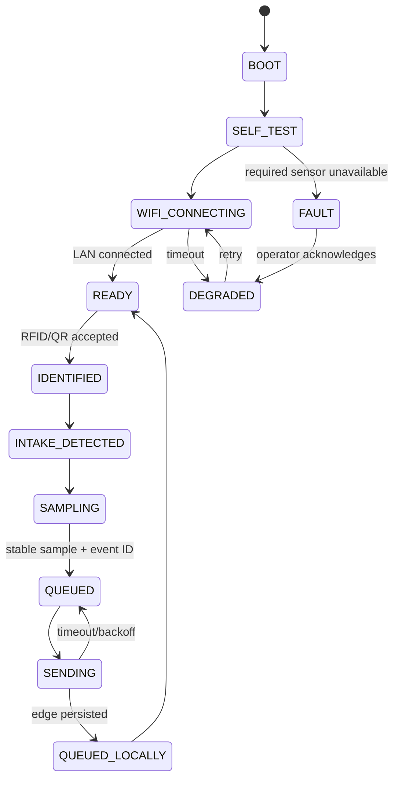

> **PLAN & STRUCTURE LOCK — v1.0:** This approved scope, stack, repository structure, contracts, ownership map, and delivery plan must not be changed by contributors or AI agents. Work only inside the assigned paths. If a change is necessary, stop and submit a `CHANGE_REQUEST`; only PARTH AJMERA may approve it, followed by an ADR and team notification.

# ESP32 Hardware and Firmware Specification

Owners: KRISHNA PANWAR (hardware/firmware) and ADITYA SILSWAL (edge integration)  
Interface authority: `06_API_IOT_CONTRACT.md`  
Rule: only physically observed readings may be labelled `source: "HARDWARE"`.

## Hardware gate before coding

KRISHNA PANWAR must inventory every available part at H0 and mark it `CONFIRMED`, `SUBSTITUTE`, or `MISSING`. A component is not in the live-demo path until it has a photo, part number, power requirement, and standalone reading. Missing hardware uses the approved emulator and is labelled simulated in UI/logs; nobody fabricates a successful hardware claim.

## BOM tiers

### Must work for the judged vertical slice

| Part | Purpose | Acceptance evidence |
|---|---|---|
| ESP32 DevKit | Controller and Wi-Fi client | Stable boot, unique device ID, heartbeat for 10 minutes |
| MFRC522 RFID reader **or** printed QR fallback | Household identifier | Reads seeded identifier five consecutive times |
| IR break-beam/proximity sensor | Intake event | Five deposits detected without false double event |
| Capacitive moisture sensor | Wet/dry supporting signal | Dry and wet calibration ranges stored and distinguishable |
| Load cell + HX711 | Weight evidence | Zero/tare plus known-mass reading within agreed tolerance |
| Laptop/phone hotspot | Local network | ESP32 reaches edge `/healthz`/ingest target reliably |
| Stable 5 V supply and common ground | Safe operation | No brownout during Wi-Fi transmit and sensor sampling |

### Should work if parts are confirmed

| Part | Purpose | Fallback |
|---|---|---|
| NEO-6M or compatible GPS | Vehicle location | Clearly labelled demo route/location fixture |
| HC-SR04 or waterproof ultrasonic sensor | Compartment fill level | Admin-controlled fixture with `SIMULATED` source |
| OLED/display | Local operator feedback | Operator web UI on laptop/phone |
| Buzzer and status LED | Immediate accepted/warning/error feedback | Serial and operator UI state |

Conditional teammate-profile target: if H0 confirms two compartments, two IR sensors, and two ultrasonic sensors, use IR1 for disposal start, debounced IR2 for crossing confirmation, and one calibrated fill sensor per wet/dry compartment. Ultrasonic values report fill only; they never classify waste. Missing parts remain `MISSING`/`NOT_PRESENT` and use an honestly labelled fixture rather than invented live data.

### Stretch only

Gas, temperature, flame, multiple compartments, compactor controls, camera/AI, LoRa, 4G, and solar backup. These may be shown as roadmap items but must not delay the must-have chain.

## Safe reference pin map

This is the v1 baseline for a common ESP32 DevKit V1. KRISHNA PANWAR must verify the exact board labels and document any approved substitution before wiring.

| Module | ESP32 pin | Electrical note |
|---|---:|---|
| RC522 SCK | GPIO18 | SPI clock, 3.3 V module |
| RC522 MISO | GPIO19 | SPI input |
| RC522 MOSI | GPIO23 | SPI output |
| RC522 SDA/SS | GPIO21 | Chip select |
| RC522 RST | GPIO22 | Reset |
| HX711 DT | GPIO32 | Digital input |
| HX711 SCK | GPIO33 | Digital output |
| Moisture analog | GPIO34 | ADC1 input; input-only; suitable while Wi-Fi is active |
| IR intake | GPIO27 | Use pull-up/pull-down appropriate to module |
| Ultrasonic trigger | GPIO26 | Optional |
| Ultrasonic echo | GPIO25 | **Use a voltage divider/level shifter; never feed 5 V directly** |
| GPS ESP32 RX | GPIO16 | UART2, connect to GPS TX |
| GPS ESP32 TX | GPIO17 | UART2, connect to GPS RX if needed |
| Buzzer | GPIO14 | Use transistor driver if current exceeds pin rating |
| Status LED | GPIO13 | Use current-limiting resistor |

RC522 is powered from 3.3 V. HC-SR04 typically uses 5 V and its echo must be level shifted. Sensors and ESP32 share ground. Motors, compactors, pumps, or high-current loads must never be powered from ESP32 GPIO or the board regulator.

## Physical build rules

- Keep wet-waste contact surfaces mechanically separated from electronics.
- Use strain relief for load-cell wires and an enclosure for the controller.
- Power off before rewiring.
- Do not operate an actual compactor from this prototype controller.
- Emergency/fire signals are safety alerts and never classification evidence.
- Record a labelled wiring photo and pin table in the KRISHNA PANWAR PR.

## Firmware state machine



`QUEUED_LOCALLY` means the local edge gateway durably persisted the event; it does not mean the cloud processed it. `ACKED` is reserved for the edge outbox state after a valid cloud receipt is persisted. The operator UI displays local and cloud status separately.

## Sampling rules

1. Debounce RFID and intake signals; one physical deposit creates one session event.
2. Tare the load cell at session start only when intake is empty.
3. Capture a short bounded sample window, remove impossible values, and store median plus min/max where useful.
4. Convert moisture ADC into the normalized range defined by calibration; retain raw ADC in evidence.
5. Generate `eventId` before the first send and reuse it for all retries.
6. Emit the frozen envelope fields `schemaVersion`, `messageId`, `messageType`, `deviceCode`, `bootId`, `sequence`, `occurredAt`, `timeQuality`, `firmwareVersion`, `payload`, and `extensions` exactly as defined in `06_API_IOT_CONTRACT.md`.
7. Never infer a penalty on the device. Device output is telemetry only.

## Calibration record

Each calibrated sensor needs a versioned JSON or Markdown record containing:

- Sensor model/serial label and ESP32 device ID.
- Date, operator, firmware commit, supply voltage, and environment.
- Raw readings for at least three known points.
- Derived offset/scale/threshold and units.
- Expected tolerance and fail/degraded limits.
- Photo/video or serial-log evidence path.

Calibration data is loaded as device configuration and its version is included in collection evidence. A rule cannot claim confidence from an uncalibrated sensor.

## Firmware module boundaries

```text
firmware/esp32/
├── include/
│   ├── app_config.h
│   ├── contract_types.h
│   ├── device_state.h
│   └── sensor_interfaces.h
├── src/
│   ├── main.cpp
│   ├── connectivity.cpp
│   ├── event_builder.cpp
│   ├── rfid_reader.cpp
│   ├── intake_sensor.cpp
│   ├── moisture_sensor.cpp
│   ├── weight_sensor.cpp
│   └── optional_gps_fill.cpp
├── test/
│   ├── test_event_builder.cpp
│   └── fixtures/
├── platformio.ini
└── README.md
```

`main.cpp` coordinates modules; it does not contain sensor drivers or JSON assembly. Wi-Fi secrets live outside source. `event_builder` is the only module that shapes the v1 payload.

## Serial log format

```text
SGV|INFO|device=esp32-sgv-01|state=READY|fw=1.0.0
SGV|EVENT|eventId=<uuid>|state=QUEUED|sequence=42
SGV|SYNC|eventId=<uuid>|edge=QUEUED_LOCALLY|http=202
SGV|WARN|sensor=moisture|state=DEGRADED|reason=OUT_OF_RANGE
```

Never print Wi-Fi passwords, device secrets, citizen name/address, or full RFID UID. Log the server-safe identifier reference/hash.

## Hardware acceptance checklist

- [ ] Board boots without brownout for 10 minutes.
- [ ] RFID/QR maps only to seeded demo household data.
- [ ] Intake sensor debouncing passes five trials.
- [ ] Moisture dry/wet samples match calibration bands.
- [ ] Known mass is within the documented tolerance after tare.
- [ ] Heartbeat reaches edge at the configured interval.
- [ ] Valid v1 event is acknowledged and visible in edge queue.
- [ ] Disconnecting Wi-Fi does not create duplicate IDs after reconnect.
- [ ] Sensor disconnect produces `DEGRADED`, not fabricated zero/normal.
- [ ] Hardware source is visually distinguishable from emulator source.

## Ownership handshake

KRISHNA PANWAR delivers a v1 JSON payload plus serial evidence to ADITYA SILSWAL. ADITYA SILSWAL tests that exact fixture at the edge boundary. AASHU JOSHI consumes the same fixture through cloud ingestion. Contract mismatches are not fixed by three private variations; they stop at `packages/contracts` and go through PARTH AJMERA.
