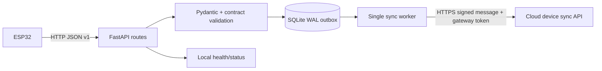

> **PLAN & STRUCTURE LOCK — v1.0:** This approved scope, stack, repository structure, contracts, ownership map, and delivery plan must not be changed by contributors or AI agents. Work only inside the assigned paths. If a change is necessary, stop and submit a `CHANGE_REQUEST`; only PARTH AJMERA may approve it, followed by an ADR and team notification.

# Local Edge Gateway Specification

Owner: ADITYA SILSWAL  
Device collaborator: KRISHNA PANWAR  
Cloud collaborator: AASHU JOSHI  
Canonical payloads: `06_API_IOT_CONTRACT.md` and `packages/contracts/**`

## Purpose

The edge gateway is the reliable boundary between unstable physical/network conditions and the cloud platform. It accepts authenticated ESP32 messages over the private LAN, validates them, durably persists them in SQLite, acknowledges local custody, then synchronizes them to the cloud without duplication.

It does **not** classify waste, award EcoCredits, create penalties, call Supabase directly, or contain citizen/admin business logic.

## Runtime topology



## Service modules

```text
services/edge-gateway/app/
├── api/             versioned device ingest, heartbeat, health, queue status
├── auth/            device authentication and request verification
├── contracts/       generated/mirrored Pydantic models verified by fixtures
├── domain/          local message/receipt state types only
├── persistence/     SQLite connection, migrations, repositories, leasing
├── services/        ingest orchestration, sync worker, backoff, cleanup
├── settings.py      validated environment configuration
└── main.py          FastAPI composition/lifespan only
```

## Local endpoints

| Method/path | Caller | Result |
|---|---|---|
| `GET /healthz` | operator/monitor | Liveness/readiness summary without secrets |
| `POST /v1/ingest/heartbeats` | ESP32 | Persists/updates device health; returns local receipt |
| `POST /v1/ingest/collection-events` | ESP32 | Validates and durably inserts event before `202` |
| `POST /v1/ingest/gps` | ESP32 | Validates/persists location sample |
| `POST /v1/ingest/telemetry` | ESP32 | Validates/persists operational telemetry |
| `GET /v1/device/config` | ESP32 | Approved non-secret device configuration/version |
| `GET /v1/messages/{messageId}` | signed device/status flow | Cloud result or transport state |

Exact request/response shapes and error codes come only from `06_API_IOT_CONTRACT.md`.

## Acknowledgement rule

`202 QUEUED_LOCALLY` may be returned only after the transaction containing the unique message and payload hash commits successfully. Memory, a Python queue, or “request received” log is not durable acknowledgement.

Duplicate behavior:

- Same `messageId` (scoped to `deviceCode`) and same payload hash: return the original local receipt; no second row.
- Same `messageId` with a different hash: `409 IDEMPOTENCY_CONFLICT`, quarantine/audit; never overwrite.
- Invalid/auth-failed payload: never place in the normal outbox.

## SQLite model

Minimum tables:

- `edge_messages`: ID, kind, device/event IDs, contract version, payload JSON/hash, local receipt, state, attempts, next attempt, lease, timestamps, last error.
- `device_health`: latest heartbeat/firmware/calibration/network/sensor health.
- `cloud_receipts`: gateway message ID, cloud receipt/result IDs, status, response hash/time.
- `edge_dead_letters`: immutable terminal error snapshot and remediation state.
- `edge_schema_migrations`: local schema version.

Use WAL mode, foreign keys, busy timeout, and `synchronous=FULL` for the judged profile. One worker claims rows atomically with a bounded lease. A crashed/expired lease returns to retry.

## Message state machine

```mermaid
stateDiagram-v2
  [*] --> PENDING: committed locally
  PENDING --> IN_FLIGHT: leased by worker
  IN_FLIGHT --> ACKED: cloud receipt persisted
  IN_FLIGHT --> PENDING: transient failure; nextAttemptAt set
  IN_FLIGHT --> AUTH_BLOCKED: 401/403
  IN_FLIGHT --> DEAD_LETTER: terminal schema/business rejection
  AUTH_BLOCKED --> PENDING: credentials repaired by human
  DEAD_LETTER --> PENDING: explicit approved remediation
```



Never delete a failed record to make status green.

## Retry policy

- Connection errors, timeout, `408`, `429`, and `5xx`: exponential backoff with jitter, capped at 60 seconds in demo profile.
- `401/403`: stop aggressive retry; show `AUTH_BLOCKED` until credential/config repair.
- Exact retry with a valid HTTP `200` stored result: persist the receipt and mark `ACKED`.
- `409 IDEMPOTENCY_CONFLICT`: dead-letter and raise a security/audit alert; never mark `ACKED`.
- `422` payload/contract mismatch: dead-letter with safe reason.
- Cloud sync v1 sends one durable message per request. A small bounded worker pool may increase concurrency; batching requires a future approved contract.
- All timeouts are explicit. An unknown cloud outcome is retried with the same idempotency identity.

## Health response requirements

Readiness must report, without secrets:

- service version and contract version;
- SQLite writable/schema status;
- sync worker running/last loop;
- cloud reachable/last successful sync age;
- pending, in-flight, auth-blocked, and dead-letter counts, plus scheduled retry timing;
- latest device heartbeat age and sensor health summary;
- disk free-space warning.

Use `200` ready and `503` not-ready. Liveness remains `200` while the process can respond, even when cloud is offline.

## Configuration

Validate environment at startup and fail closed for missing production secrets. Required: host/port, DB path, cloud base URL, cloud token, supported contract version, request size, timeouts, retry limits, log level. Secrets are redacted and never returned by config/health endpoints.

## Testing acceptance

- Valid/invalid canonical fixtures match contract behavior.
- Kill process immediately after `202`; restart recovers event.
- Queue 20 events with cloud offline; restart; reconnect; all reconcile once.
- Replay same event/payload; one local/cloud event and credit.
- Same ID/different body; quarantined mismatch.
- Cloud 429/500 retries; 401 pauses; 422 dead-letters.
- Two attempted worker instances cannot process one row concurrently.
- Health truthfully distinguishes process, DB, cloud, queue, and device state.

## Operator run commands

Root scripts are authoritative when created:

```bash
npm run dev:edge
npm run test:edge
npm run edge:status
npm run edge:queue
```

The service must shut down gracefully: stop accepting new sync leases, finish/cancel bounded in-flight HTTP, persist state, and close SQLite.
