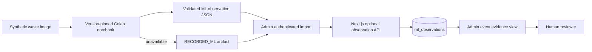

> **PLAN & STRUCTURE LOCK — v1.0:** This approved scope, stack, repository structure, contracts, ownership map, and delivery plan must not be changed by contributors or AI agents. Work only inside the assigned paths. If a change is necessary, stop and submit a `CHANGE_REQUEST`; only PARTH AJMERA may approve it, followed by an ADR and team notification.

# Optional ML Evidence Integration

Status: P1, post-core, non-release-blocking  
Owner: PARTH AJMERA  
Implementation reviewers: AASHU JOSHI and BHUMIKA SINGH RAWAT  
UI reviewer: YASHVARDHAN DOBHAL

## 1. Decision

The teammate-proposed YOLO/Google Colab workflow is approved only as an optional evidence enhancer after the real ESP32 → edge → cloud → EcoCredit/review journey passes G4. It is not part of device contract v1, never runs on the ESP32 or edge gateway, and never becomes an automatic penalty authority.

The core demo must succeed when Colab, the model, the internet, or this entire feature is unavailable.

## 2. Allowed outcome

An administrator may attach a structured ML observation to an existing collection event. A reviewer can see its label, predicted category, confidence, model/weights identity, provenance, and input hash beside sensor evidence.

ML v1 may:

- display a human-friendly supporting observation;
- help a human reviewer inspect a flagged case;
- show a clearly labelled innovation scene after the core demonstration.

ML v1 may not:

- change `ACCEPTED`, `FLAGGED`, or review state automatically;
- award, deduct, reverse, or redeem EcoCredits;
- create, price, waive, or pay a penalty;
- receive real citizen images or identity data;
- add a direct Colab-to-database credential path;
- block collection ingestion or the release candidate.

## 3. Go/no-go gate

Start only when all are true:

1. G4 is green and the golden hardware/offline journey is protected by tests.
2. Work is confined to `scripts/demo/ml/**` plus the already-approved optional observation API, migration, UI, and tests.
3. Model, weights, dataset, and dependency versions and licenses are recorded.
4. Only synthetic or team-created non-personal waste images are used.
5. No token, cookie, private Drive mount, citizen identifier, face, address, or location is present in the notebook or saved output.
6. A deterministic `RECORDED_ML` JSON artifact and screenshot are available offline.
7. PARTH AJMERA, AASHU JOSHI, and BHUMIKA SINGH RAWAT approve the PR.

Ultralytics currently describes its default model/software path as AGPL-3.0 with separate commercial terms. Resolve compatibility before adding its package or weights; uncertainty is `NO-GO`, not legal approval. See [Ultralytics licensing](https://www.ultralytics.com/license) and [prediction documentation](https://docs.ultralytics.com/modes/predict). Colab resources are not guaranteed, and shared notebooks can expose code/output/comments; follow the [Google Colab FAQ](https://research.google.com/colaboratory/faq.html).

## 4. Frozen flow



The notebook does not hold a Supabase service-role key or gateway secret. It exports a JSON artifact; an authenticated admin imports it through the web application.

## 5. Repository boundary

```text
scripts/demo/ml/
├── README.md
├── sgv-yolo-evidence.ipynb
├── requirements-lock.txt
├── model-manifest.json
├── fixtures/
│   ├── synthetic-input/
│   └── recorded-results/
└── validate-observation.mjs
```

Do not create `ml/`, `ai/`, a Python cloud service, or another top-level application. The notebook is a demo tool, not a production runtime.

## 6. Observation contract

The import endpoint and database shape are canonical in `06_API_IOT_CONTRACT.md` and `05_DATA_SCHEMA.md`. The artifact contains:

```json
{
  "schemaVersion": "1.0",
  "observationId": "61db989a-2fd8-4879-b17b-c0a70731dce2",
  "eventId": "0191a15d-8cfa-7ec1-bc58-59465353b0fe",
  "source": "MANUAL_COLAB",
  "model": {
    "family": "YOLO",
    "version": "pinned-in-model-manifest",
    "weightsSha256": "0123456789abcdef0123456789abcdef0123456789abcdef0123456789abcdef"
  },
  "inputSha256": "abcdef0123456789abcdef0123456789abcdef0123456789abcdef0123456789",
  "detectedLabel": "plastic_wrapper",
  "predictedCategory": "DRY",
  "confidence": 0.96,
  "inferenceMs": 84,
  "observedAt": "2026-08-22T03:14:00.000Z",
  "extensions": {}
}
```

Allowed `source`: `MANUAL_COLAB`, `RECORDED_ML`. Allowed category: `WET`, `DRY`, `REJECT`, `UNKNOWN`. Confidence is `0..1`; it is not a calibrated probability unless validation proves that claim.

## 7. UI rules

The admin evidence card must always show:

- `OPTIONAL ML EVIDENCE`;
- source badge (`MANUAL_COLAB` or `RECORDED_ML`);
- model version and input/weights hash suffixes;
- detected label, predicted category, and confidence;
- “Supporting evidence only — human decision required.”

Citizen and operator screens do not receive raw model output in v1. No result is worded as “AI proved a violation.” Low confidence, unknown class, or multiple objects render `UNCERTAIN`; they do not silently select the highest class.

## 8. Required tests

- valid and invalid artifact schema tests;
- admin allowed; citizen/operator/anonymous denied;
- same observation ID + same body is idempotent; changed body is `409`;
- missing/unknown event rejected safely;
- confidence boundaries `0`, `1`, below threshold, and non-finite value;
- no raw image/base64, PII, HTML, URL fetch, or secret accepted;
- an observation cannot update event state or any ledger/penalty table;
- live notebook failure switches to `RECORDED_ML` in under 15 seconds;
- deleting/omitting the optional feature leaves every P0 test green.

## 9. Production evolution

A production camera/edge-AI path requires a representative labelled dataset, accuracy and subgroup/error evaluation, model monitoring, retention/DPIA decisions, device attestation, secure image handling, capacity tests, and license approval. It requires a future ADR and contract version; the hackathon notebook is not production evidence.
