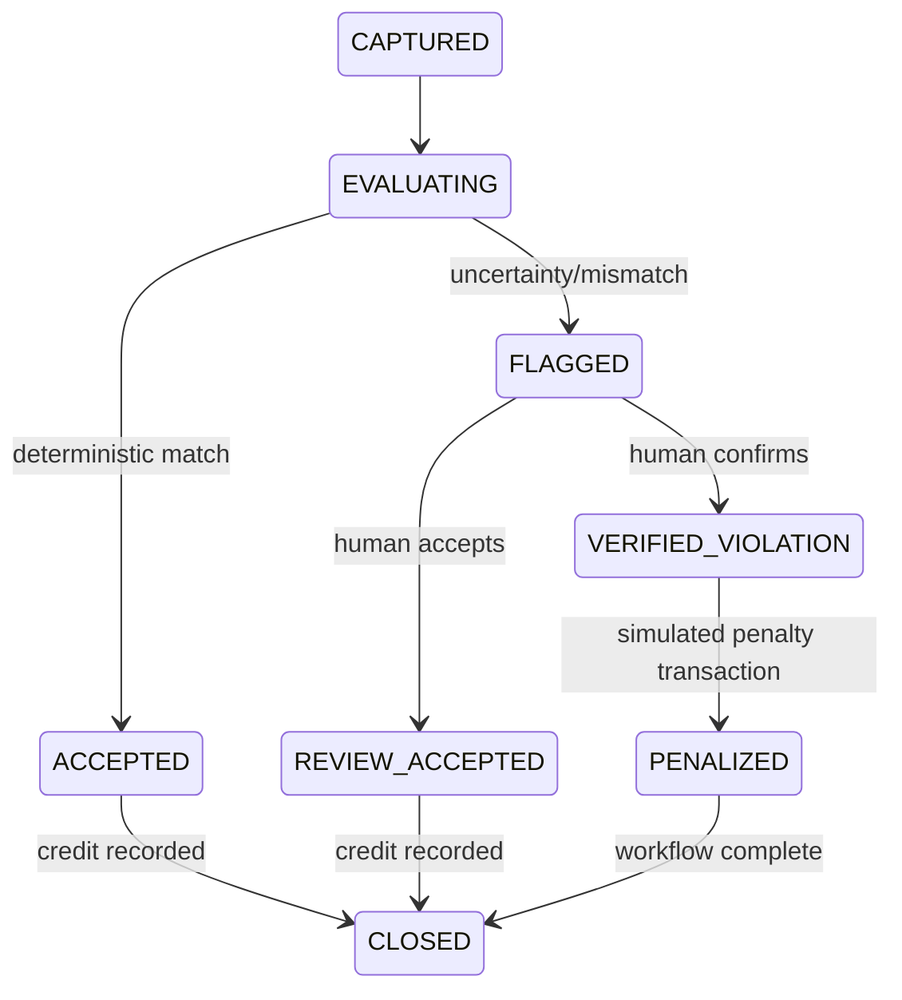

> **PLAN & STRUCTURE LOCK — v1.0:** This approved scope, stack, repository structure, contracts, ownership map, and delivery plan must not be changed by contributors or AI agents. Work only inside the assigned paths. If a change is necessary, stop and submit a `CHANGE_REQUEST`; only PARTH AJMERA may approve it, followed by an ADR and team notification.

# Waste Decision, EcoCredit, and Penalty Rules

Status: canonical rules baseline v1.0  
Code owner: AASHU JOSHI  
Approval owner: PARTH AJMERA  
Database/test reviewer: BHUMIKA SINGH RAWAT

## 1. Non-negotiable policy

Automation has only two business outcomes: `ACCEPTED` or `FLAGGED`. It never declares guilt, deducts points, or creates a penalty. Only an authorized human decision of `VERIFIED_VIOLATION` may create one simulated penalty.

The pure implementation belongs in `packages/rules-engine`. Thresholds are versioned configuration, not frontend, firmware, edge, or API-route constants.

## 2. Inputs

The engine receives an immutable normalized snapshot:

- `eventId`, declared category, and ruleset version;
- identifier/session validity;
- intake/motion confirmation;
- moisture percentage plus quality/calibration version;
- weight plus quality/calibration version when present;
- safety flags;
- explicit missing/degraded states.

Fill level, GPS, vehicle connectivity, and optional ML observations are operational/supporting evidence. They do not decide segregation in v1.

## 3. Demo ruleset

The seeded profile is deterministic:

```json
{
  "version": "rules-1.0.0",
  "awardPoints": 50,
  "dryMaximumMoisturePercent": 35,
  "wetMinimumMoisturePercent": 65,
  "minimumWeightKg": 0.05,
  "maximumWeightKg": 50,
  "requiredQuality": "GOOD",
  "rejectAlwaysRequiresReview": true
}
```

The moisture values are prototype thresholds, not universal scientific facts. KRISHNA PANWAR must prove that calibrated dry/wet samples are separable before this profile is published. A threshold change creates a new immutable ruleset version; it never rewrites historical decisions.

## 4. Evaluation order

First matching rule wins:

| Priority | Condition | Outcome | Explanation code |
|---:|---|---|---|
| 1 | Safety/fire signal active | `FLAGGED` and separate safety alert | `SAFETY_HOLD` |
| 2 | Identifier/session invalid | `FLAGGED` | `IDENTITY_OR_SESSION_INVALID` |
| 3 | Intake not confirmed | `FLAGGED` | `INTAKE_NOT_CONFIRMED` |
| 4 | Required reading missing, degraded, out of range, or uncalibrated | `FLAGGED` | `EVIDENCE_INSUFFICIENT` |
| 5 | Weight outside configured range | `FLAGGED` | `WEIGHT_OUT_OF_RANGE` |
| 6 | Declared `REJECT` | `FLAGGED` | `REJECT_REQUIRES_REVIEW` |
| 7 | Declared `DRY` and moisture <= dry maximum | `ACCEPTED` | `DRY_MOISTURE_MATCH` |
| 8 | Declared `DRY` and moisture > dry maximum | `FLAGGED` | `DRY_MOISTURE_ELEVATED` |
| 9 | Declared `WET` and moisture >= wet minimum | `ACCEPTED` | `WET_MOISTURE_MATCH` |
| 10 | Declared `WET` and moisture < wet minimum | `FLAGGED` | `WET_MOISTURE_LOW` |
| 11 | Any unhandled combination | `FLAGGED` | `UNCLASSIFIED_EVIDENCE` |

The 35–65 gap is deliberately conservative: a wet declaration below 65 and dry declaration above 35 are reviewed. Environmental moisture is therefore never treated as automatic misconduct.

## 5. State and value effects



| Transition | Allowed value effect |
|---|---|
| `EVALUATING -> ACCEPTED` | Insert one `COLLECTION_REWARD` of +50 points |
| `FLAGGED -> REVIEW_ACCEPTED` | Insert one `COLLECTION_REWARD` of +50 points |
| `FLAGGED -> VERIFIED_VIOLATION` | No EcoCredit debit; enable one simulated penalty record |
| Erroneous prior award | Human-authorized compensating `REVERSAL`; never edit/delete original |
| Redemption | Separate user-requested `REDEMPTION_DEBIT`; never confused with a penalty |

Negative automatic points such as `-10` or `-20` are forbidden. A penalty is money-denominated simulated civic workflow after review, not a hidden reward-ledger deduction.

## 6. Idempotency and transactions

For a given event and ruleset:

1. evaluation returns the same outcome and ordered explanation codes;
2. one accepted event creates at most one collection reward;
3. one review case receives at most one terminal review decision;
4. one verified event creates at most one penalty;
5. retry returns the stored canonical result;
6. different content under the same immutable identity returns `IDEMPOTENCY_CONFLICT`.

Event decision plus reward creation occurs in one database transaction. Review decision plus state transition and optional penalty creation also occurs in one database transaction. Application-only checks are insufficient; database constraints enforce uniqueness.

## 7. Optional ML treatment

`MANUAL_COLAB` and `RECORDED_ML` observations are excluded from the automatic ruleset v1. The reviewer may read them as supporting evidence, alongside source/model/confidence provenance. A high-confidence disagreement may be visually emphasized, but software does not change state, revoke a credit, or create a penalty from it.

## 8. Required tests

At minimum cover:

- both exact moisture boundaries (35 and 65) and values immediately around them;
- wet, dry, and reject declarations;
- missing, degraded, estimated, out-of-range, and uncalibrated readings;
- no-intake, invalid identity/session, weight boundaries, and safety hold;
- same input repeated and concurrent duplicate processing;
- flagged event creates no ledger or penalty row;
- review-accepted creates the award once;
- verified violation creates no reward debit and only one simulated penalty;
- attempted citizen/operator review, direct balance edit, and direct penalty insert are rejected;
- explanation codes and ruleset hash remain stable in snapshots;
- every possible normalized input returns a defined result without throwing.

## 9. Judge-safe explanation

“The sensors provide evidence, not guilt. Calibrated, matching evidence earns a transparent EcoCredit. Anything incomplete or inconsistent goes to a human reviewer. Even optional computer vision cannot fine a citizen. Every decision and value change is versioned, idempotent, and auditable.”
