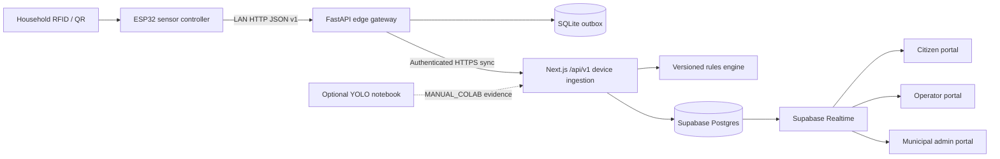

> **PLAN & STRUCTURE LOCK — v1.0:** This approved scope, stack, repository structure, contracts, ownership map, and delivery plan must not be changed by contributors or AI agents. Work only inside the assigned paths. If a change is necessary, stop and submit a `CHANGE_REQUEST`; only PARTH AJMERA may approve it, followed by an ADR and team notification.

# SGV 2.0 — Smart Waste Ecosystem

> Real ESP32 sensing, resilient offline edge sync, live municipal operations, and transparent citizen EcoCredits with human-verified penalties.

This is the complete root `README.md` for the future repository `sgv-2-smart-waste-ecosystem`. Copy it from `DOCUMENTAION/README.md` to `/README.md` without rewriting its architecture or scope.

## The problem

Municipal waste collection often has no reliable chain connecting a household, a pickup, the vehicle, the waste category, sensor evidence, and the final reward or penalty. Citizens receive little useful feedback, operators lose data when networks fail, and municipal teams lack real-time operational visibility.

## The solution

SGV 2.0 adds a verifiable digital handshake to each collection:

1. An RFID/QR identifier opens a household collection session.
2. ESP32-connected sensors capture intake, moisture, weight, fill level, and available GPS evidence.
3. A local FastAPI edge gateway validates and queues the event, even without internet.
4. The cloud API stores the event idempotently and applies an explainable rules version.
5. If its separate stretch gate passes, a clearly labelled manual-Colab YOLO observation can be attached as supporting evidence.
6. A compliant event earns EcoCredits exactly once.
7. An ambiguous event enters human verification; it is never automatically fined.
8. Citizen, operator, municipal, and IoT-control views update with a complete audit trail.

The judge-visible differentiator is not “a bin with sensors.” It is the complete, resilient accountability loop from physical collection to fair administrative action.

## Demo in one line

`RFID → real sensor event → offline-capable edge gateway → cloud ingestion → accepted/flagged decision → EcoCredit or human review → citizen/admin proof`

## Architecture



If the internet fails, the edge gateway acknowledges locally persisted events and retries them later with the same event ID. The cloud returns the original result for a replay, so credits cannot be duplicated.

## MVP capabilities

### Citizen

- Secure account and linked household identifier.
- Collection history and decision explanation.
- EcoCredit balance backed by an immutable ledger.
- Verified penalties, simulated bill items, and dispute tracking.
- Approximate assigned-vehicle status and location.

### Vehicle operator

- Identifier lookup with minimum necessary citizen information.
- Collection session, category selection, live sensor health, and result.
- Network state, pending-sync count, and degraded-mode warnings.
- Safety alert visibility independent of compliance decisions.

### Municipal administrator

- Fleet and device health dashboard with live/stale state.
- Collection-event search and evidence view.
- Human verification queue with accept/confirm-violation actions.
- Versioned reward/penalty rules, EcoCredit audit, penalties, disputes, and simulated bills.
- Ward, vehicle, category, compliance, and sync analytics.
- Dedicated IoT-control view for exact component health, queue depth, last-seen time, and clearly labelled hardware/simulator/ML sources.

### Hardware and edge

- Real ESP32 heartbeat and sensor payload.
- RFID RC522 or opaque QR fallback, IR intake, capacitive moisture, HX711 load cell; GPS/fill-level when hardware is confirmed.
- Conditional dual-compartment target: wet/dry intake activity and fill sensing with two IR and two ultrasonic sensors only if every part passes inventory and calibration.
- LAN-only HTTP transport for the reliable MVP.
- SQLite-backed outbox, exponential retry, idempotent cloud synchronization, and a hardware emulator using the same contract.

## Fairness and safety guarantees

- One noisy sensor cannot trigger a penalty.
- `FLAGGED` means “needs review,” not “guilty.”
- Only an authorized officer can confirm a violation.
- Every reward, reversal, penalty, dispute decision, and rule version is auditable.
- Real citizen and payment data are forbidden in the prototype.
- EcoCredits, redemptions, and municipal billing are simulated for the hackathon.

## Technology stack

| Area | Choice |
|---|---|
| Web and cloud API | Next.js App Router, React, strict TypeScript |
| UI | Tailwind CSS, shadcn/ui primitives, Leaflet/OpenStreetMap |
| Data, auth, realtime | Supabase Postgres, Auth, Realtime |
| Business decisions | Pure TypeScript versioned rules engine |
| Local edge server | Python, FastAPI, Pydantic, SQLite |
| Firmware | ESP32, PlatformIO, Arduino framework, ArduinoJson |
| Contracts | OpenAPI 3.1 and JSON Schema; JSON over HTTP |
| Testing | Vitest, Playwright, Pytest, Ruff, PlatformIO CI |
| Deployment | Vercel + Supabase; edge on a laptop/Raspberry Pi over LAN |
| Optional ML evidence | License-approved, version-pinned YOLO-compatible Colab notebook under `scripts/demo/ml`; never a decision authority |

Exact dependency versions are pinned at scaffold time and locked in source control. See `DOCUMENTAION/03_TECH_STACK.md`.

## Repository layout

```text
apps/web/                 Next.js portals and cloud API
services/edge-gateway/    FastAPI local gateway and offline queue
firmware/esp32/           ESP32 firmware and hardware tests
packages/contracts/       Canonical API and telemetry contracts
packages/rules-engine/    Pure decision and EcoCredit logic
supabase/                 Migrations, RLS policies, deterministic seed
tests/                    Cross-system integration, E2E, and fixtures
scripts/                  Approved setup, seed, replay, demo, and gated ML-evidence scripts
DOCUMENTAION/             Frozen project documentation
.github/                  CODEOWNERS, workflows, PR/issue templates
```

Do not create an alternative folder layout. See `DOCUMENTAION/04_REPOSITORY_STRUCTURE.md` before coding.

## Quick start

### Prerequisites

- Git, Node.js LTS, npm, Python 3.12, and PlatformIO.
- A Supabase project and Vercel account.
- One laptop on the same Wi-Fi/hotspot as the ESP32.
- Hardware confirmed in `DOCUMENTAION/07_HARDWARE_FIRMWARE.md`.

### 1. Install JavaScript workspaces

```bash
npm ci
```

### 2. Configure local environment

```bash
cp .env.example .env.local
```

Fill only local values. Never commit `.env.local`.

### 3. Start the web app

```bash
npm run dev:web
```

### 4. Start the edge gateway

```bash
npm run dev:edge
```

### 5. Run real hardware or the approved emulator

```bash
npm run firmware:upload
# or, only when hardware is unavailable:
npm run simulate:device
```

### 6. Run the quality gates

```bash
npm run lint
npm run typecheck
npm test
npm run build
```

The root scripts are created during foundation setup and must match the runbook; contributors must not invent conflicting commands.

## Environment variables

| Variable | Location | Secret | Purpose |
|---|---|---:|---|
| `NEXT_PUBLIC_SUPABASE_URL` | web | No | Supabase project URL |
| `NEXT_PUBLIC_SUPABASE_PUBLISHABLE_KEY` | web | No | Browser key protected by RLS |
| `SUPABASE_SERVICE_ROLE_KEY` | server only | Yes | Restricted administrative DB access |
| `EDGE_GATEWAY_SHARED_SECRET` | edge | Yes | Local device-to-edge authentication |
| `CLOUD_DEVICE_SYNC_TOKEN` | edge/cloud | Yes | Edge gateway cloud identity |
| `CLOUD_API_BASE_URL` | edge | No | Cloud sync target |
| `EDGE_DATABASE_PATH` | edge | No | SQLite queue file path |
| `NEXT_PUBLIC_MAP_TILE_URL` | web | No | Map tile template |

The full reference and rotation procedure is in `DOCUMENTAION/13_DEPLOYMENT_RUNBOOK.md`.

## Team and branches

| Member | GitHub-linked email | Branch | Primary area |
|---|---|---|---|
| PARTH AJMERA | `ajmeraparth.official@gmail.com` | `team/parth-ajmera-governance` | Product, repository, approvals, contracts, integration, demo, optional ML-demo coordination |
| YASHVARDHAN DOBHAL | `yashvardhandobhal944@gmail.com` | `team/yashvardhan-dobhal-web-ui` | Citizen/operator/admin UI and browser client; Cursor user |
| AASHU JOSHI | `aashujoshisbps@gmail.com` | `team/aashu-joshi-cloud-api` | Cloud APIs, auth enforcement, rules engine |
| KRISHNA PANWAR | `krishnapanwar464@gmail.com` | `team/krishna-panwar-esp32` | Hardware, wiring, calibration, ESP32 firmware |
| ADITYA SILSWAL | `adiisilswal@gmail.com` | `team/aditya-silswal-edge-gateway` | FastAPI edge gateway, SQLite queue, sync, emulator |
| BHUMIKA SINGH RAWAT | `bhumika282007@gmail.com` | `team/bhumika-singh-rawat-data-qa` | Supabase schema/RLS, CI, tests, QA, release evidence |

All work goes from a `team/*` branch to protected `integration` through a reviewed PR. Only milestone PRs go from `integration` to protected `main`.

## Demo seed

The deterministic seed contains only fictional data, including household `HH-10452` and citizen “Aarav.” Never replace it with real citizen information. Demo credentials and device tokens belong in the team password manager or local environment, not this README.

## Documentation

Start at [`DOCUMENTAION/00_READ_ME_FIRST.md`](DOCUMENTAION/00_READ_ME_FIRST.md). Coding agents receive only the root copy of [`DOCUMENTAION/AGENTS.md`](DOCUMENTAION/AGENTS.md) plus their issue prompt.

## Current status

Planning baseline completed; application source is not yet scaffolded. Update this section only through PARTH AJMERA's release process with real test and deployment links—never add fake badges or claim unverified hardware success.

## Policy alignment

The prototype is designed to support source-segregated collection under India's [Solid Waste Management Rules, 2026](https://moef.gov.in/uploads/pdf-uploads/pdf_69a16e3b04c107.91022257.pdf) and privacy-by-design practices informed by the [Digital Personal Data Protection Rules, 2025](https://www.meity.gov.in/static/uploads/2025/11/53450e6e5dc0bfa85ebd78686cadad39.pdf). This is product design guidance, not a claim of municipal certification or legal compliance.

## Known MVP limits

- Sensor fusion supports decisions but cannot identify arbitrary waste with certainty.
- No production payment, UPI, government billing, Aadhaar/municipal SSO, SMS, or route optimization.
- Optional manual-Colab computer vision is unvalidated supporting evidence only; the core loop works without it, and it cannot make a penalty decision.
- GPS may use the physical module only if it passes the hardware gate; otherwise the UI clearly labels approved demo coordinates as simulated.
- The cloud deployment depends on internet; the collection gateway continues queuing locally.

## Roadmap

After the judged MVP: MQTT fleet transport, camera-assisted classification with validated data, route optimization, multilingual PWA, approved municipal billing integration, production device certificates, richer anomaly detection, and processing-facility trip closure.

## License

Choose and add the team-approved license before making the repository public. Until then, no license is implied.
