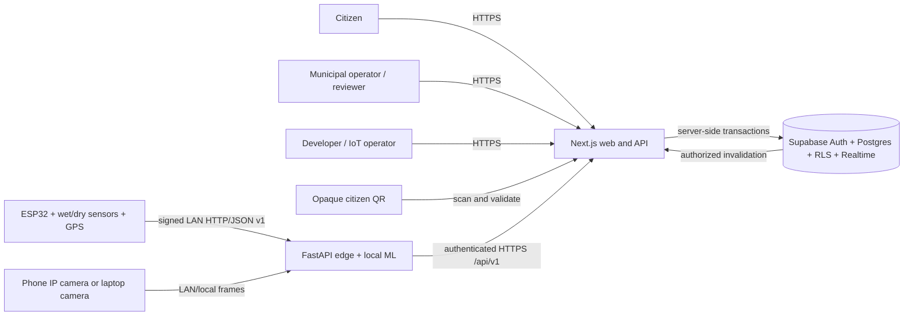
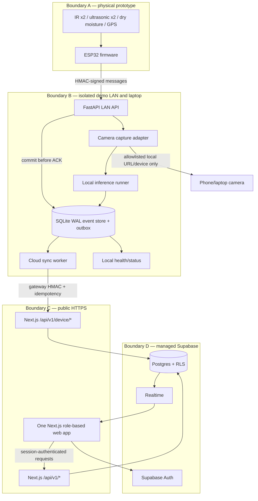
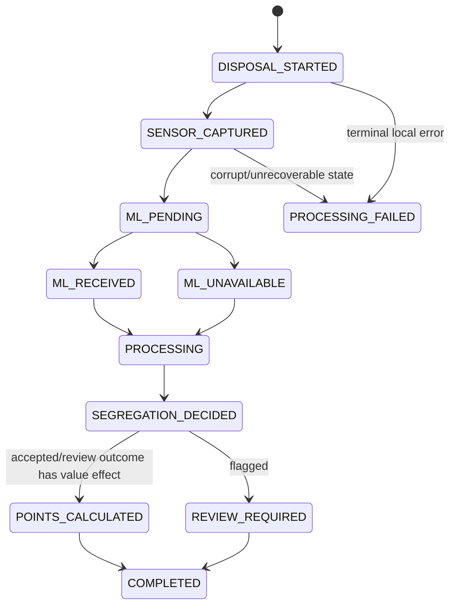
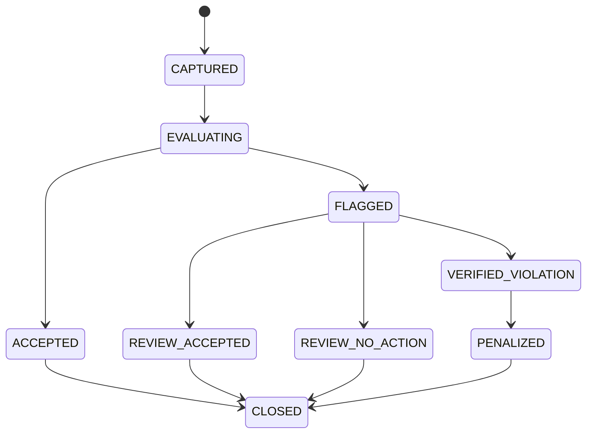
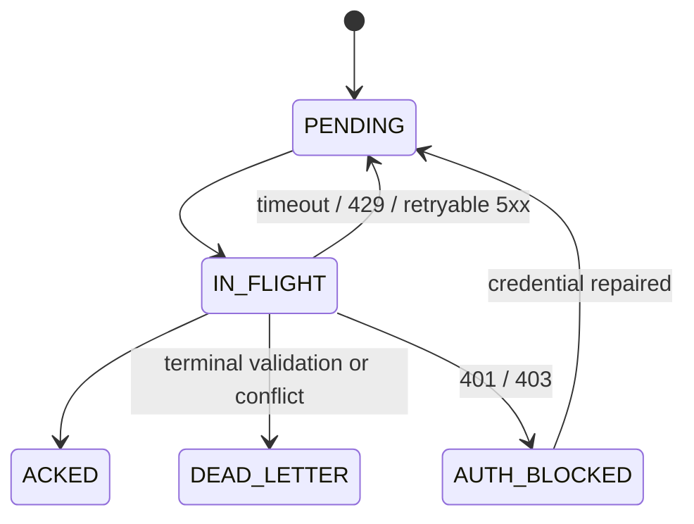
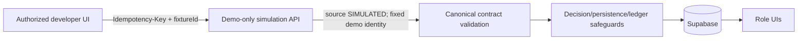
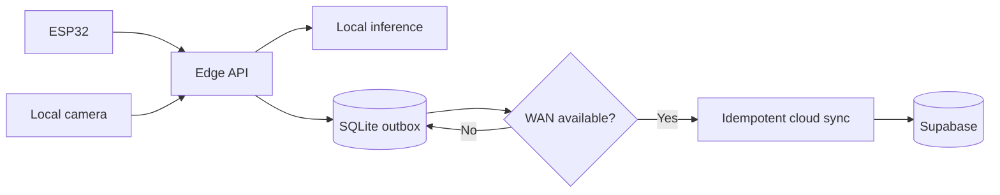

> **PLAN & STRUCTURE LOCK — v2.0:** This approved scope, stack, repository structure, contracts, ownership map, truth-tier model, and delivery plan must not be changed by contributors or AI agents. Work only inside assigned paths. If a change is necessary, stop and submit a `CHANGE_REQUEST`; only PARTH AJMERA may approve it, followed by an ADR, contract/document updates, and team notification.

# Smart Waste Ecosystem System Architecture

Status: approved implementation target
Architecture version: 2.0
Deployment model: one web/cloud application plus one local edge runtime and one ESP32 prototype

## 1. Architecture in one sentence

An ESP32 sends signed event and telemetry messages across an isolated LAN to a FastAPI edge gateway, which commits them to SQLite before acknowledgement, orchestrates event-correlated local camera inference, and synchronizes an immutable idempotent message over HTTPS to a single Next.js/Supabase cloud application serving citizen, municipal, and developer experiences.

## 2. Architectural drivers

The design optimizes for:

1. a credible real hardware-to-UI demonstration;
2. continued local capture when WAN connectivity fails;
3. one event identity across firmware, camera, model, cloud, ledger, and UI;
4. explainable and review-safe decisions;
5. duplicate-safe financial-like effects;
6. parallel work by six first-time contributors;
7. honest separation of real, simulated, preview, and roadmap behavior.

The design deliberately avoids three frontend deployments, direct device-to-cloud credentials, a second cloud backend, MQTT, production billing, and autonomous adverse decisions.

## 3. Truth-tier deployment boundary

| Boundary | Tier 1 real | Tier 2 preview | Tier 3 roadmap |
|---|---|---|---|
| Hardware | one ESP32 dual-compartment prototype | none | dedicated AI camera, autonomous sorter |
| Edge | durable FastAPI/SQLite + local capture/inference | none | fleet edge appliance/broker |
| Cloud | event, ML metadata, rules, ledger, review, health, seed | no preview-only table/route | multi-zone/fleet/routing/billing |
| Web | citizen, municipal, developer critical workflows | static map/ETA, multi-truck, discount, reports, stepper | native apps/production integrations |

Preview fixtures are frontend assets and cannot cross into Tier 1 persistence or claims.

## 4. System context



Local capture/inference is internet-independent after dependencies and weights are installed. Cloud persistence, remote UI, managed authentication, and Realtime still require WAN; documentation and demo narration must state this precisely.

## 5. Container and trust-boundary view



### Trust rules

1. The demo LAN is private but not trusted; device requests are signed, timestamped, sequence-checked, and bounded.
2. Plain HTTP is allowed only on the isolated LAN and never through public port forwarding.
3. ESP32 has no Vercel, Supabase, model-service, or citizen credentials.
4. The camera source is configured locally; a request cannot supply an arbitrary URL, preventing SSRF.
5. Edge has a narrowly scoped gateway secret, never the Supabase service-role key.
6. Browser authorization is enforced server-side and by RLS, not by hidden buttons.
7. Raw camera frames are not stored by default. Model metadata is stored without PII.
8. Simulated events use fixed demo identities and permanent `SIMULATED` source labels.

## 6. Fixed technology and runtime topology

| Runtime | Responsibility | Persistent state |
|---|---|---|
| ESP32 | compartment selection/trigger, sensor normalization, heartbeat, stable message identity, LAN signing | minimal retry/result state in device storage |
| FastAPI edge | device auth/validation, local durable custody, event aggregation, camera/model orchestration, cloud retry, diagnostics | SQLite WAL |
| Local inference runner | burst capture, preprocessing, pinned-model execution, supported-class mapping, score/latency/provenance | model artifact outside Git; manifest/checksum in Git |
| Next.js server | authenticated APIs, idempotency claim, business orchestration, rules, RLS-safe reads | none beyond cloud database |
| Supabase | Auth, Tier 1 source of truth, constraints, RLS, Realtime invalidation | Postgres |
| Next.js browser | role-specific presentation and typed API consumption | session-safe browser state only |

## 7. Repository/component boundaries

```text
apps/web/                         one Next.js app and /api/v1 routes
packages/contracts/               schemas, OpenAPI, fixtures, generated types
packages/rules-engine/            pure rules-2.0.0 evaluation
services/edge-gateway/            FastAPI, SQLite, capture, inference, sync, health
firmware/esp32/                   hardware drivers and signed LAN client
supabase/                         migrations, RLS tests, deterministic seed
tests/                            cross-runtime contract, HIL, integration, E2E
scripts/demo/                     reset, seed, model manifest/setup, safe fixtures
DOCUMENTATION/                    approved plans and contracts
```

Dependency direction:

```text
UI / HTTP routes / firmware adapters
             -> application orchestration
             -> pure domain rules + contract types
             -> persistence, network, camera, and hardware adapters
```

The rules engine imports no framework, database, network, camera, or UI code.

## 8. Component responsibilities

| Component | Owns | Must not own |
|---|---|---|
| Firmware | pins/drivers, calibration application, debounce, boot/sequence IDs, LAN signing, health | cloud auth, camera control, points, adverse decisions |
| Edge API | LAN auth, validation, local commit, replay/result cache | final role authorization or direct Supabase writes |
| Edge event coordinator | processing state, camera trigger, inference timeout/correlation, immutable cloud-body creation | unsupported label invention or point logic |
| Edge SQLite | raw accepted message, event progress, inference metadata, outbox, attempts/results | authoritative citizen balance or review truth |
| Cloud device API | gateway auth, strict validation, atomic idempotency claim, transaction orchestration | accepting client-supplied point/role/ownership fields |
| Rules engine | deterministic accepted/flagged result, severity suggestion, explanation codes | automatic negative ledger writes |
| Cloud domain layer | event transaction, review/ledger/badge projection, safe notifications | hidden side effects outside transaction/audit |
| Citizen UI | own QR/history/balance/result/tier/dispute | other citizen or raw technical data |
| Municipal UI | scan, active event, authorized evidence/review | direct balance mutation |
| Developer UI | health, telemetry, ML provenance/log summaries, demo simulation | PII exposure or production simulation |

## 9. Real collection and inference flow

```mermaid
sequenceDiagram
    autonumber
    participant U as Citizen/operator
    participant E as ESP32
    participant G as Edge API/coordinator
    participant Q as SQLite
    participant C as Camera
    participant M as Local model
    participant A as Next.js device API
    participant R as Rules engine
    participant D as Supabase
    participant W as Web roles

    U->>E: Select compartment; present approved QR/session
    E->>E: IR debounce; sensor snapshot; stable IDs
    E->>G: Signed DISPOSAL_EVENT_V1
    G->>G: Verify signature/replay/schema
    G->>Q: BEGIN; persist event + progress; COMMIT
    G-->>E: 202 QUEUED_LOCALLY
    G->>C: Capture bounded frame burst for eventId
    C-->>G: Frames or typed capture failure
    G->>M: Infer with pinned model/class map
    M-->>G: label/category/score/provenance or typed failure
    G->>Q: Persist ML result; freeze exact cloud body/outbox
    loop until terminal cloud result
        G->>A: Signed POST /api/v1/device/sync
        A->>A: Verify and atomically claim messageId/body hash
        A->>R: Evaluate rules-2.0.0
        R-->>A: ACCEPTED or FLAGGED + reasons
        A->>D: One transaction: event/evidence/decision/+10 or review/audit
        D-->>A: Commit stable result
        A-->>G: Correlated stable result
        G->>Q: ACK and cache result
    end
    D-->>W: Authorized invalidation hint
    W->>A: Refetch authorized event/ledger/health
```

### Correlation and timeout rules

- `eventId` is created once before physical capture and appears in sensor, local processing, ML, cloud, ledger, audit, and UI records.
- Edge persists the sensor event before starting camera work. ML failure cannot erase or un-acknowledge it.
- Camera uses a bounded burst; the model result records the chosen frame input hash, not raw image content.
- If capture/inference misses its deadline, edge records `ML_UNAVAILABLE`, freezes a valid cloud body, and the cloud flags review with zero point effect.
- A late result after body freeze is diagnostic-only unless an approved additive observation endpoint and policy explicitly allow it; it cannot silently change the decision.
- Edge restart resumes nonterminal processing from SQLite or times it out deterministically.

## 10. Orthogonal state machines

### 10.1 Processing lifecycle



`ML_UNAVAILABLE` is not a failed disposal. It is explicit degraded evidence.

### 10.2 Decision/review lifecycle



`PENALIZED` here means a reviewed negative point transaction in the prototype, not a real legal or financial fine.

### 10.3 Edge transport lifecycle



Never use one state field to represent all three dimensions.

## 11. Decision and value integrity

1. `rules-2.0.0` is pure, deterministic, immutable, and identified by config hash.
2. Confidence bands are model-score bands, not claimed probability/calibration.
3. Fill and GPS are operational context, not segregation-decision inputs.
4. Moisture applies only where physically captured in the dry path.
5. Supported matching evidence may become `ACCEPTED` and append one `+10`.
6. Unknown, low-confidence, mismatch, degraded evidence, high dry-path moisture, or environmental wetting becomes `FLAGGED` with `0` immediate effect.
7. Only human `VERIFIED_VIOLATION` can authorize reviewed `-10` or severe wet-in-dry `-20`.
8. Balance is computed from the append-only point ledger; correction uses a compensating row.
9. Database uniqueness and transaction boundaries enforce exactly-once effects.

## 12. Cloud transaction boundary

For a new device message, one atomic server transaction:

1. claims the message/idempotency key and payload hash;
2. resolves active device and QR/session references;
3. inserts disposal event, sensor readings, and ML detection metadata;
4. evaluates/stores the immutable rules result;
5. appends `+10` **or** opens a review case—never both;
6. updates derived badge/tier projections if applicable;
7. appends audit record;
8. stores the stable response for replay.

Same key and same hash returns the stored result. Same key and different hash returns `409 IDEMPOTENCY_CONFLICT`. A timeout is an unknown outcome, so callers retry the same key/body.

## 13. Realtime and reads

Realtime is a freshness hint, not the source of truth:

1. perform an authenticated initial REST read;
2. subscribe only to the smallest authorized topic/table;
3. receive stable IDs and safe summary, not raw secrets;
4. refetch the authorized REST resource;
5. poll/refetch after reconnect or when Realtime is unavailable.

| Change | Consumer | Safe effect |
|---|---|---|
| own disposal result | citizen | refetch own event and balance |
| active disposal result | municipal | refetch authorized active event |
| review case | reviewer/admin | refetch queue |
| device/edge/model health | developer | refetch technical health |
| raw sensor reading | developer only | authorized bounded telemetry read; not broadcast to citizen |

Tier 1 municipal “live counter” may be derived client-side from the live event feed. Full aggregated analytics remain Tier 2 seeded previews.

## 14. Simulation architecture



Simulation joins **after** physical firmware/sensor/camera ingress. It is therefore a processing fallback, not hardware proof. It is disabled outside demo mode, rate-limited, audited, isolated to fictional identities, permanently labelled, and excluded from real-hardware success counts.

## 15. Deployment topology and offline behavior

### Demo deployment

- ESP32, camera phone, and edge laptop use a dedicated hotspot/router.
- FastAPI binds to an approved LAN address such as `sgv-edge.local:8080`.
- SQLite uses persistent storage, not `/tmp`.
- Model weights and manifest are installed and hash-checked before network shutdown tests.
- Edge calls Vercel-hosted Next.js over HTTPS; Next.js uses server-only Supabase credentials.
- Web roles use separate browser profiles to prevent session confusion.

### WAN outage



Local capture can continue while WAN is down. Cloud pages show their last known data as stale; they do not update until sync succeeds.

## 16. Failure behavior

| Failure | Expected safe behavior |
|---|---|
| Wrong/expired QR | reject binding; no event value effect; rate-limit and safe audit |
| Duplicate IR | debounce/replay same intent; no duplicate event |
| Incomplete event | timeout to typed failed/incomplete state; no fabricated evidence |
| Sensor missing/out of range | persist quality, flag review, no automatic negative |
| GPS no fix | store `NO_FIX`; never store `0,0` |
| Camera unreachable/stale | `ML_UNAVAILABLE`; flag review; edge custody remains valid |
| Model missing/hash mismatch | health `FAILED`, no inference, no adverse effect |
| Unsupported/multiple/low-score detection | `UNKNOWN`/flagged with evidence details |
| Edge restart after ACK | resume from SQLite; message eventually finalizes/syncs once |
| WAN outage | queue grows; local health visible; cloud state stale |
| Cloud timeout after commit | retry same bytes/key and receive stored result |
| Gateway auth failure | enter `AUTH_BLOCKED`; stop retry storm; operator alert |
| Realtime failure | authorized REST polling/refetch preserves function |
| Simulation abuse attempt | disabled/403/rate-limit; audit without citizen effect |

## 17. Prototype quality targets

| Quality | Target |
|---|---|
| Edge durable ACK | p95 <=250 ms on the actual demo LAN, excluding ML |
| Camera + inference | measured p50/p95 on actual laptop; release threshold fixed at G1 |
| Online cloud result | target approximately two seconds after a finalized edge message, measured rather than promised |
| Heartbeat | default 30 seconds, configurable |
| Queue durability | survive process restart and at least the expected 24-hour demo traffic |
| Idempotency retention | at least 30 days for prototype device/sensitive mutations |
| Accessibility | keyboard critical flows, visible focus, text plus color, responsive citizen view |
| Observability | IDs, safe state, latency, queue, model/version/source; no secrets/PII |

## 18. Architecture acceptance gates

- [ ] Real QR/session and selected-compartment IR create one stable event.
- [ ] Dual fill, dry moisture, GPS/fix, and component health report honest quality.
- [ ] SQLite survives kill/restart after device ACK.
- [ ] Phone/laptop capture and pinned local inference correlate to the event with WAN disabled.
- [ ] Unknown/low/failure paths flag safely.
- [ ] Reconnect drains at least three queued events exactly once.
- [ ] Same ID/same body replays; changed body returns `409`.
- [ ] Accepted event appends one `+10`; automated negative count remains zero.
- [ ] Human review is required for `-10/-20`, and dispute reversal is append-only.
- [ ] Citizen cross-account, municipal scope, and developer raw-data authorization tests pass.
- [ ] Simulation remains labelled/isolated and cannot count as hardware proof.
- [ ] Tier 2 route/schema inventory remains empty.

## 19. Related contracts

- `04_REPOSITORY_STRUCTURE.md` — module paths and dependency enforcement.
- `05_DATA_SCHEMA.md` — authoritative cloud and edge persistence model.
- `06_API_IOT_CONTRACT.md` — wire formats, auth, errors, and idempotency.
- `08_EDGE_GATEWAY.md` — local durability, capture/inference, retry, and operations.
- `21_ML_INTEGRATION.md` — model/camera/class-map and fallback gate.
- `22_WASTE_DECISION_POINTS.md` — exact decision/value semantics.
