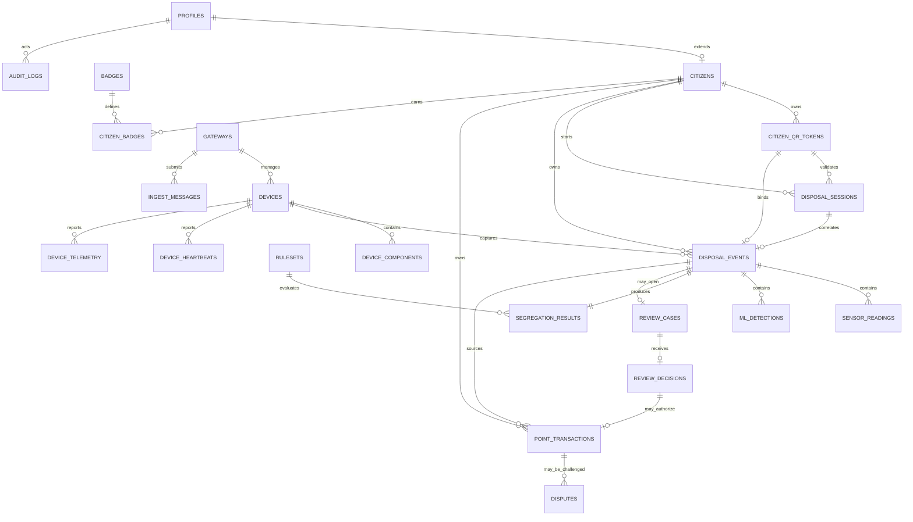

> **PLAN & STRUCTURE LOCK — v2.0:** This approved scope, stack, repository structure, contracts, ownership map, truth-tier model, and delivery plan must not be changed by contributors or AI agents. Work only inside assigned paths. If a change is necessary, stop and submit a `CHANGE_REQUEST`; only PARTH AJMERA may approve it, followed by an ADR, contract/document updates, and team notification.

# Data Schema and Integrity Contract

Schema baseline: 2.0
Cloud database: Supabase PostgreSQL
Edge database: SQLite WAL
Authority: this file defines persistence names, relationships, constraints, RLS intent, and transaction invariants; migrations are the executable implementation.

## 1. Scope and data-design rules

1. Only Tier 1 real functionality receives cloud tables.
2. Postgres is authoritative after synchronization. SQLite holds durable local event/transport state, not citizen balances or final review truth.
3. IDs are UUIDs generated by the initiating component and preserved end to end.
4. All boundary timestamps are UTC RFC 3339; Postgres uses `timestamptz`. Device occurrence and server receipt are distinct.
5. Points are signed integers. A balance is `sum(point_transactions.points_delta)`, never an editable column.
6. Sensor values are normalized with units, quality, and calibration version. Missing data is `NULL` plus `MISSING`, never zero.
7. Raw QR values are never stored. Store a server-peppered HMAC lookup hash and safe suffix.
8. Sensor readings, ML detections, automated results, final review decisions, point transactions, and audit records are append-only.
9. One event may receive at most one automated award and at most one verified violation entry. Reversal is a new compensating transaction.
10. A negative point transaction is impossible without an authorized `VERIFIED_VIOLATION` review.
11. Event processing, decision/review, and edge transport states remain separate.
12. JSONB may hold bounded technical metadata, but searchable identity, state, amounts, timestamps, category, confidence, and source are typed columns.
13. Raw camera frames/base64/images/remote URLs are not stored in these tables by default.
14. `SIMULATED` and `SEEDED` provenance is permanent and queryable.

## 2. Tier 1 table catalog

| Table/view | Purpose | Mutability |
|---|---|---|
| `profiles` | Supabase Auth extension and trusted application role | restricted status/profile updates |
| `citizens` | fictional citizen application profile and privacy-safe alias | restricted |
| `citizen_qr_tokens` | opaque, expiring/rotatable QR lookup and replay state | lifecycle only |
| `disposal_sessions` | short-lived QR-to-device/compartment binding created by municipal scan | controlled lifecycle |
| `gateways` | provisioned local edge identity | restricted admin/heartbeat |
| `devices` | ESP32 identity, firmware and status | restricted admin/heartbeat |
| `device_components` | configured sensor/component inventory | admin/config lifecycle |
| `ingest_messages` | atomic cloud idempotency claim and stored result | insert then terminal result |
| `idempotency_records` | user/admin/simulation mutation idempotency | insert then terminal result |
| `rulesets` | immutable decision/point configuration | draft then publish/freeze |
| `disposal_events` | central normalized disposal record | controlled state transitions |
| `sensor_readings` | event-linked sensor evidence | append-only |
| `ml_detections` | event-linked model metadata/result | append-only |
| `segregation_results` | immutable automated `ACCEPTED`/`FLAGGED` evaluation | append-only |
| `review_cases` | human queue for flagged events | controlled lifecycle |
| `review_decisions` | authorized final review | append-only |
| `point_transactions` | award, verified negative, reversal, adjustment | append-only |
| `disputes` | citizen challenge to an own negative transaction | controlled lifecycle |
| `badges` | frozen demo badge/tier definitions | seed/admin-managed |
| `citizen_badges` | auditable earned badge projection | insert/revocation record only |
| `device_heartbeats` | component-level health history | append-only, retention-managed |
| `device_telemetry` | non-decisional fill/GPS/operational readings | append-only, retention-managed |
| `audit_logs` | security/administrative/source audit | append-only |
| `citizen_point_balances` | derived ledger balance view | computed |
| `citizen_tiers` | derived Bronze/Silver/Gold/Platinum view | computed |
| `leaderboard_public` | opt-in fictional alias aggregate | security-barrier view/API projection |

Do not create production `trucks`, `truck_locations`, `collection_routes`, `municipal_zones`, bill/discount, payment, report-aggregation, or geofence tables for Tier 2 previews. Runtime logs belong in redacted structured process logs; do not duplicate `system_logs`, `device_logs`, and `ml_logs` tables.

## 3. Entity relationships



`disposal_events` does not duplicate full sensor, ML, result, or point objects in JSON. It may keep bounded summary fields for efficient listing, but the normalized child tables are authoritative.

## 4. Canonical enums

| Domain | Values |
|---|---|
| Application role | `CITIZEN`, `MUNICIPAL_OPERATOR`, `MUNICIPAL_REVIEWER`, `MUNICIPAL_ADMIN`, `DEVELOPER`, `SYSTEM_ADMIN` |
| Event source | `HARDWARE`, `RECORDED_HARDWARE`, `SIMULATED`, `SEEDED` |
| Evidence source | `LOCAL_LIVE`, `RECORDED_ML`, `SIMULATED`, `SEEDED` |
| Compartment/category | `WET`, `DRY` (`UNKNOWN` is ML-only, never a selected compartment) |
| Processing | `DISPOSAL_STARTED`, `SENSOR_CAPTURED`, `ML_PENDING`, `ML_RECEIVED`, `ML_UNAVAILABLE`, `PROCESSING`, `SEGREGATION_DECIDED`, `POINTS_CALCULATED`, `REVIEW_REQUIRED`, `COMPLETED`, `PROCESSING_FAILED` |
| Decision | `CAPTURED`, `EVALUATING`, `ACCEPTED`, `FLAGGED`, `REVIEW_ACCEPTED`, `REVIEW_NO_ACTION`, `VERIFIED_VIOLATION`, `PENALIZED`, `CLOSED` |
| Quality/health | `OK`, `GOOD`, `DEGRADED`, `MISSING`, `FAILED`, `OUT_OF_RANGE`, `UNKNOWN`, `NOT_APPLICABLE` as allowed by field contract |
| Confidence band | `LOW`, `MEDIUM`, `HIGH` |
| Point entry | `AWARD`, `VIOLATION`, `REVERSAL` |
| Review decision | `REVIEW_ACCEPTED`, `REVIEW_NO_ACTION`, `VERIFIED_VIOLATION` |
| Dispute | `OPEN`, `UNDER_REVIEW`, `UPHELD`, `REVERSED`, `CLOSED` |

## 5. Core Postgres shape

The migration owner may split this into ordered files but must preserve semantics, names, constraints, and indexes. SQL below is an implementation shape; final migrations should use reusable enums/functions where that improves clarity without weakening checks.

### 5.1 Identity and QR

```sql
create extension if not exists pgcrypto;

create table public.profiles (
  id uuid primary key references auth.users(id) on delete restrict,
  app_role text not null check (app_role in (
    'CITIZEN', 'MUNICIPAL_OPERATOR', 'MUNICIPAL_REVIEWER',
    'MUNICIPAL_ADMIN', 'DEVELOPER', 'SYSTEM_ADMIN'
  )),
  display_name text not null check (char_length(display_name) between 1 and 80),
  is_active boolean not null default true,
  created_at timestamptz not null default now(),
  updated_at timestamptz not null default now()
);

create table public.citizens (
  id uuid primary key default gen_random_uuid(),
  profile_id uuid not null unique references public.profiles(id) on delete restrict,
  citizen_code text not null unique,
  leaderboard_alias text not null unique check (char_length(leaderboard_alias) between 3 and 24),
  leaderboard_opt_in boolean not null default false,
  status text not null default 'ACTIVE' check (status in ('ACTIVE', 'SUSPENDED', 'INACTIVE')),
  created_at timestamptz not null default now(),
  updated_at timestamptz not null default now()
);

create table public.citizen_qr_tokens (
  id uuid primary key default gen_random_uuid(),
  citizen_id uuid not null references public.citizens(id) on delete restrict,
  lookup_hash text not null unique check (lookup_hash ~ '^[0-9a-f]{64}$'),
  display_suffix text not null check (char_length(display_suffix) between 4 and 8),
  session_nonce uuid not null,
  status text not null default 'ACTIVE'
    check (status in ('ACTIVE', 'USED', 'EXPIRED', 'REVOKED')),
  issued_at timestamptz not null default now(),
  expires_at timestamptz not null,
  used_at timestamptz,
  revoked_at timestamptz,
  check (expires_at > issued_at),
  check ((status = 'USED') = (used_at is not null)),
  check ((status = 'REVOKED') = (revoked_at is not null))
);

create index citizen_qr_active_idx
  on public.citizen_qr_tokens (citizen_id, expires_at)
  where status = 'ACTIVE';

create table public.disposal_sessions (
  id uuid primary key,
  event_id uuid not null unique,
  citizen_id uuid not null references public.citizens(id) on delete restrict,
  qr_token_id uuid not null references public.citizen_qr_tokens(id) on delete restrict,
  expected_device_code text not null,
  selected_compartment text not null check (selected_compartment in ('WET', 'DRY')),
  status text not null default 'PENDING'
    check (status in ('PENDING', 'BOUND_TO_EDGE', 'CONSUMED', 'EXPIRED', 'CANCELLED')),
  created_by uuid not null references public.profiles(id),
  binding_nonce uuid not null unique,
  issued_at timestamptz not null default now(),
  expires_at timestamptz not null,
  bound_at timestamptz,
  consumed_at timestamptz,
  check (expires_at > issued_at),
  check (
    (status = 'PENDING' and bound_at is null) or
    (status in ('BOUND_TO_EDGE', 'CONSUMED') and bound_at is not null) or
    status in ('EXPIRED', 'CANCELLED')
  ),
  check ((status = 'CONSUMED') = (consumed_at is not null))
);

create index disposal_sessions_pending_idx
  on public.disposal_sessions (expected_device_code, expires_at)
  where status in ('PENDING', 'BOUND_TO_EDGE');
```

`lookup_hash = hex(HMAC-SHA256(server_pepper, normalized_random_token))`. The pepper stays only in server secret storage. The QR contains a version plus random token/reference, never citizen data. Validation consumes/binds according to `06_API_IOT_CONTRACT.md`.

### 5.2 Gateway, device, and inventory

```sql
create table public.gateways (
  id uuid primary key default gen_random_uuid(),
  gateway_code text not null unique,
  credential_version integer not null default 1 check (credential_version > 0),
  status text not null default 'ACTIVE' check (status in ('ACTIVE', 'SUSPENDED', 'REVOKED')),
  last_seen_at timestamptz,
  created_at timestamptz not null default now()
);

create table public.devices (
  id uuid primary key default gen_random_uuid(),
  gateway_id uuid not null references public.gateways(id) on delete restrict,
  device_code text not null unique,
  firmware_version text,
  status text not null default 'ACTIVE'
    check (status in ('PROVISIONING', 'ACTIVE', 'DEGRADED', 'SUSPENDED', 'REVOKED')),
  last_seen_at timestamptz,
  created_at timestamptz not null default now(),
  updated_at timestamptz not null default now()
);

create table public.device_components (
  id uuid primary key default gen_random_uuid(),
  device_id uuid not null references public.devices(id) on delete restrict,
  component_code text not null,
  component_type text not null check (component_type in (
    'IR', 'ULTRASONIC', 'MOISTURE', 'GPS', 'CAMERA', 'EDGE', 'MODEL'
  )),
  compartment text check (compartment in ('WET', 'DRY')),
  calibration_version text,
  is_enabled boolean not null default true,
  created_at timestamptz not null default now(),
  unique (device_id, component_code)
);
```

Secrets are not stored in rows. Only credential version/status is persisted; actual gateway/device keys remain in protected runtime provisioning.

### 5.3 Idempotency

```sql
create table public.ingest_messages (
  message_id uuid primary key,
  gateway_id uuid not null references public.gateways(id),
  device_id uuid not null references public.devices(id),
  schema_version text not null check (schema_version = '1.1'),
  message_type text not null check (message_type in (
    'DISPOSAL_EVENT_V1', 'HEARTBEAT_V1', 'TELEMETRY_V1'
  )),
  boot_id uuid not null,
  sequence_no bigint not null check (sequence_no >= 0),
  payload_hash text not null check (payload_hash ~ '^[0-9a-f]{64}$'),
  processing_status text not null default 'RECEIVED'
    check (processing_status in ('RECEIVED', 'PROCESSED', 'REJECTED')),
  result_code text,
  result_json jsonb,
  occurred_at timestamptz,
  received_at timestamptz not null default now(),
  processed_at timestamptz,
  unique (device_id, boot_id, sequence_no)
);

create table public.idempotency_records (
  scope text not null,
  actor_id uuid not null references public.profiles(id),
  idempotency_key uuid not null,
  request_hash text not null check (request_hash ~ '^[0-9a-f]{64}$'),
  status text not null check (status in ('IN_PROGRESS', 'SUCCEEDED', 'FAILED')),
  response_status integer,
  response_json jsonb,
  created_at timestamptz not null default now(),
  completed_at timestamptz,
  primary key (scope, actor_id, idempotency_key)
);
```

Atomic claim is a unique insert, never an unprotected `SELECT` then `INSERT`. Exact replay returns the stored result. Changed body under the same key is `409 IDEMPOTENCY_CONFLICT`.

### 5.4 Rules, event, sensor, and ML

```sql
create table public.rulesets (
  id uuid primary key default gen_random_uuid(),
  version text not null unique,
  status text not null check (status in ('DRAFT', 'PUBLISHED', 'RETIRED')),
  config jsonb not null,
  config_hash text not null check (config_hash ~ '^[0-9a-f]{64}$'),
  created_by uuid not null references public.profiles(id),
  created_at timestamptz not null default now(),
  published_at timestamptz,
  check ((status = 'DRAFT' and published_at is null) or
         (status in ('PUBLISHED', 'RETIRED') and published_at is not null))
);

create unique index one_published_ruleset
  on public.rulesets ((status)) where status = 'PUBLISHED';

create table public.disposal_events (
  id uuid primary key,
  source_message_id uuid unique references public.ingest_messages(message_id),
  session_id uuid unique references public.disposal_sessions(id),
  citizen_id uuid not null references public.citizens(id),
  qr_token_id uuid references public.citizen_qr_tokens(id),
  device_id uuid not null references public.devices(id),
  event_source text not null check (event_source in (
    'HARDWARE', 'RECORDED_HARDWARE', 'SIMULATED', 'SEEDED'
  )),
  selected_compartment text not null check (selected_compartment in ('WET', 'DRY')),
  processing_state text not null check (processing_state in (
    'DISPOSAL_STARTED', 'SENSOR_CAPTURED', 'ML_PENDING', 'ML_RECEIVED',
    'ML_UNAVAILABLE', 'PROCESSING', 'SEGREGATION_DECIDED',
    'POINTS_CALCULATED', 'REVIEW_REQUIRED', 'COMPLETED', 'PROCESSING_FAILED'
  )),
  decision_state text not null check (decision_state in (
    'CAPTURED', 'EVALUATING', 'ACCEPTED', 'FLAGGED', 'REVIEW_ACCEPTED',
    'REVIEW_NO_ACTION', 'VERIFIED_VIOLATION', 'PENALIZED', 'CLOSED'
  )),
  latitude numeric(9,6) check (latitude is null or latitude between -90 and 90),
  longitude numeric(9,6) check (longitude is null or longitude between -180 and 180),
  location_accuracy_m numeric(10,2) check (location_accuracy_m is null or location_accuracy_m >= 0),
  location_quality text not null default 'NO_FIX'
    check (location_quality in ('GPS_2D', 'GPS_3D', 'NO_FIX', 'SIMULATED')),
  occurred_at timestamptz,
  edge_received_at timestamptz not null,
  cloud_received_at timestamptz not null default now(),
  completed_at timestamptz,
  failure_code text,
  created_at timestamptz not null default now(),
  updated_at timestamptz not null default now(),
  check ((location_quality in ('NO_FIX', 'SIMULATED')) or
         (latitude is not null and longitude is not null)),
  check ((latitude is null) = (longitude is null))
);

create table public.sensor_readings (
  id uuid primary key default gen_random_uuid(),
  event_id uuid not null references public.disposal_events(id) on delete restrict,
  component_code text not null,
  sensor_code text not null check (sensor_code in (
    'IR_TRIGGERED', 'FILL_WET_PERCENT', 'FILL_DRY_PERCENT', 'MOISTURE_DRY_PERCENT'
  )),
  numeric_value numeric,
  boolean_value boolean,
  unit text not null check (unit in ('BOOLEAN', 'PERCENT')),
  quality text not null check (quality in (
    'GOOD', 'DEGRADED', 'MISSING', 'FAILED', 'OUT_OF_RANGE', 'NOT_APPLICABLE'
  )),
  calibration_version text,
  captured_at timestamptz,
  created_at timestamptz not null default now(),
  check (num_nonnulls(numeric_value, boolean_value) <= 1),
  check (quality not in ('GOOD', 'DEGRADED') or num_nonnulls(numeric_value, boolean_value) = 1),
  unique (event_id, sensor_code, component_code)
);

create table public.ml_detections (
  id uuid primary key,
  event_id uuid not null unique references public.disposal_events(id) on delete restrict,
  evidence_source text not null check (evidence_source in (
    'LOCAL_LIVE', 'RECORDED_ML', 'SIMULATED', 'SEEDED'
  )),
  status text not null check (status in (
    'DETECTED', 'NO_DETECTION', 'MULTIPLE_CONFLICTING', 'UNAVAILABLE', 'TIMED_OUT', 'FAILED'
  )),
  model_family text not null,
  model_version text not null,
  weights_sha256 text not null check (weights_sha256 ~ '^[0-9a-f]{64}$'),
  class_map_version text not null,
  input_sha256 text check (input_sha256 is null or input_sha256 ~ '^[0-9a-f]{64}$'),
  detected_label text,
  friendly_label text,
  predicted_category text check (predicted_category in ('WET', 'DRY', 'UNKNOWN')),
  score numeric(6,5) check (score is null or score between 0 and 1),
  confidence_band text check (confidence_band in ('LOW', 'MEDIUM', 'HIGH')),
  inference_ms integer check (inference_ms is null or inference_ms between 0 and 600000),
  observed_at timestamptz not null,
  created_at timestamptz not null default now(),
  check (
    (status = 'DETECTED' and detected_label is not null and score is not null)
    or
    (status <> 'DETECTED' and detected_label is null and score is null)
  )
);

create index disposal_events_citizen_time_idx
  on public.disposal_events (citizen_id, occurred_at desc);
create index disposal_events_active_idx
  on public.disposal_events (created_at desc)
  where processing_state not in ('COMPLETED', 'PROCESSING_FAILED');
create index sensor_readings_event_idx on public.sensor_readings (event_id);
create index ml_detections_event_idx on public.ml_detections (event_id, created_at desc);
```

### 5.5 Automated result, review, ledger, and dispute

```sql
create table public.segregation_results (
  id uuid primary key default gen_random_uuid(),
  event_id uuid not null unique references public.disposal_events(id) on delete restrict,
  ruleset_id uuid not null references public.rulesets(id),
  outcome text not null check (outcome in ('ACCEPTED', 'FLAGGED')),
  suggested_severity text not null check (suggested_severity in ('NONE', 'NORMAL', 'SEVERE')),
  reason_codes text[] not null,
  input_hash text not null check (input_hash ~ '^[0-9a-f]{64}$'),
  evaluated_at timestamptz not null default now()
);

create table public.review_cases (
  id uuid primary key default gen_random_uuid(),
  event_id uuid not null unique references public.disposal_events(id) on delete restrict,
  status text not null default 'OPEN' check (status in ('OPEN', 'ASSIGNED', 'DECIDED', 'CANCELLED')),
  reason_codes text[] not null,
  suggested_severity text not null check (suggested_severity in ('NONE', 'NORMAL', 'SEVERE')),
  assigned_to uuid references public.profiles(id),
  opened_at timestamptz not null default now(),
  decided_at timestamptz
);

create table public.review_decisions (
  id uuid primary key default gen_random_uuid(),
  case_id uuid not null unique references public.review_cases(id) on delete restrict,
  reviewer_id uuid not null references public.profiles(id),
  decision text not null check (decision in (
    'REVIEW_ACCEPTED', 'REVIEW_NO_ACTION', 'VERIFIED_VIOLATION'
  )),
  violation_severity text check (violation_severity in ('NORMAL', 'SEVERE')),
  reason_code text not null,
  notes text check (notes is null or char_length(notes) <= 500),
  decided_at timestamptz not null default now(),
  check (
    (decision = 'VERIFIED_VIOLATION' and violation_severity is not null)
    or
    (decision in ('REVIEW_ACCEPTED', 'REVIEW_NO_ACTION') and violation_severity is null)
  )
);

create table public.point_transactions (
  id uuid primary key default gen_random_uuid(),
  citizen_id uuid not null references public.citizens(id) on delete restrict,
  event_id uuid references public.disposal_events(id) on delete restrict,
  review_decision_id uuid references public.review_decisions(id) on delete restrict,
  entry_kind text not null check (entry_kind in ('AWARD', 'VIOLATION', 'REVERSAL')),
  points_delta integer not null,
  reason_code text not null,
  reversed_transaction_id uuid references public.point_transactions(id) on delete restrict,
  created_by uuid references public.profiles(id),
  idempotency_key uuid not null unique,
  created_at timestamptz not null default now(),
  metadata jsonb not null default '{}',
  check (
    (entry_kind = 'AWARD' and points_delta = 10 and event_id is not null) or
    (entry_kind = 'VIOLATION' and points_delta in (-10, -20)
      and event_id is not null and review_decision_id is not null) or
    (entry_kind = 'REVERSAL' and points_delta <> 0 and reversed_transaction_id is not null)
  )
);

create unique index one_award_per_event
  on public.point_transactions (event_id)
  where entry_kind = 'AWARD';
create unique index one_violation_per_event
  on public.point_transactions (event_id)
  where entry_kind = 'VIOLATION';
create unique index one_reversal_per_transaction
  on public.point_transactions (reversed_transaction_id)
  where entry_kind = 'REVERSAL';

create table public.disputes (
  id uuid primary key default gen_random_uuid(),
  citizen_id uuid not null references public.citizens(id) on delete restrict,
  negative_transaction_id uuid not null unique references public.point_transactions(id) on delete restrict,
  status text not null default 'OPEN'
    check (status in ('OPEN', 'UNDER_REVIEW', 'UPHELD', 'REVERSED', 'CLOSED')),
  citizen_reason text not null check (char_length(citizen_reason) between 5 and 500),
  resolution_reason text,
  resolved_by uuid references public.profiles(id),
  created_at timestamptz not null default now(),
  resolved_at timestamptz
);
```

Cross-table checks that SQL `CHECK` cannot safely enforce are implemented by a security-definer transaction/RPC plus triggers/tests:

- `AWARD` requires event state `ACCEPTED` or `REVIEW_ACCEPTED` and matching citizen.
- `REVIEW_NO_ACTION` closes the review at zero and creates no point transaction.
- `VIOLATION -10` requires `VERIFIED_VIOLATION/NORMAL`; `-20` requires `VERIFIED_VIOLATION/SEVERE`.
- reviewer role must be active `MUNICIPAL_REVIEWER`, `MUNICIPAL_ADMIN`, or `SYSTEM_ADMIN`.
- automated ingest transaction cannot insert `VIOLATION`.
- dispute citizen must own the negative transaction.
- reversal delta must exactly negate the referenced transaction unless an explicit audited policy says otherwise.

### 5.6 Badges and privacy-safe leaderboard

```sql
create table public.badges (
  id uuid primary key default gen_random_uuid(),
  code text not null unique,
  name text not null,
  description text not null,
  minimum_points integer not null check (minimum_points >= 0),
  is_demo_enabled boolean not null default true,
  created_at timestamptz not null default now()
);

create table public.citizen_badges (
  id uuid primary key default gen_random_uuid(),
  citizen_id uuid not null references public.citizens(id) on delete restrict,
  badge_id uuid not null references public.badges(id) on delete restrict,
  awarded_at timestamptz not null default now(),
  award_reason text not null,
  source_balance integer not null,
  revoked_at timestamptz,
  revocation_reason text,
  unique (citizen_id, badge_id)
);

create view public.citizen_point_balances
with (security_invoker = true) as
select c.id as citizen_id, coalesce(sum(pt.points_delta), 0)::bigint as points_balance
from public.citizens c
left join public.point_transactions pt on pt.citizen_id = c.id
group by c.id;

create view public.citizen_tiers
with (security_invoker = true) as
select b.citizen_id, b.points_balance,
  case
    when b.points_balance >= 2000 then 'PLATINUM'
    when b.points_balance >= 1000 then 'GOLD'
    when b.points_balance >= 500 then 'SILVER'
    else 'BRONZE'
  end as tier
from public.citizen_point_balances b;

create view public.leaderboard_public
with (security_barrier = true, security_invoker = true) as
select
  c.leaderboard_alias,
  b.points_balance,
  dense_rank() over (order by b.points_balance desc, c.leaderboard_alias asc) as rank
from public.citizens c
join public.citizen_point_balances b on b.citizen_id = c.id
where c.leaderboard_opt_in and c.status = 'ACTIVE';

revoke all on public.citizen_point_balances from anon, authenticated;
revoke all on public.citizen_tiers from anon, authenticated;
revoke all on public.leaderboard_public from anon, authenticated;
grant select on public.citizen_point_balances to service_role;
grant select on public.citizen_tiers to service_role;
grant select on public.leaderboard_public to service_role;
```

The leaderboard view is queried only through a server-authorized endpoint. Its underlying-table RLS remains in force because the view is a security-invoker view. Do not grant anonymous direct access, expose citizen/profile IDs, or create a global public table with identity details.

### 5.7 Health, telemetry, and audit

```sql
create table public.device_heartbeats (
  id uuid primary key default gen_random_uuid(),
  device_id uuid not null references public.devices(id) on delete restrict,
  firmware_version text not null,
  uptime_seconds bigint not null check (uptime_seconds >= 0),
  free_heap_bytes bigint check (free_heap_bytes is null or free_heap_bytes >= 0),
  wifi_rssi_dbm integer,
  edge_reachable boolean not null,
  component_health jsonb not null,
  occurred_at timestamptz,
  received_at timestamptz not null default now()
);

create table public.device_telemetry (
  id uuid primary key default gen_random_uuid(),
  device_id uuid not null references public.devices(id) on delete restrict,
  telemetry_code text not null check (telemetry_code in (
    'FILL_WET_PERCENT', 'FILL_DRY_PERCENT', 'GPS_LOCATION'
  )),
  numeric_value numeric,
  location jsonb,
  quality text not null check (quality in (
    'GOOD', 'DEGRADED', 'MISSING', 'FAILED', 'OUT_OF_RANGE', 'NO_FIX'
  )),
  occurred_at timestamptz,
  received_at timestamptz not null default now(),
  check (num_nonnulls(numeric_value, location) <= 1)
);

create table public.audit_logs (
  id uuid primary key default gen_random_uuid(),
  actor_profile_id uuid references public.profiles(id),
  actor_type text not null check (actor_type in (
    'USER', 'GATEWAY', 'DEVICE', 'SYSTEM', 'SIMULATOR', 'SEED'
  )),
  action text not null,
  target_type text not null,
  target_id uuid,
  request_id uuid,
  source_label text,
  safe_metadata jsonb not null default '{}',
  occurred_at timestamptz not null default now()
);
```

`component_health` keys/values are validated by the API contract and bounded; it may not contain secrets or raw PII. Retention defaults for heartbeats/telemetry are documented in migrations/runbook and do not delete event decision/ledger/audit evidence.

## 6. Edge SQLite schema

SQLite is separate from Postgres and optimized for durable local orchestration.

```sql
pragma journal_mode = WAL;
pragma synchronous = FULL;
pragma foreign_keys = ON;

create table local_events (
  event_id text primary key,
  message_id text not null unique,
  device_code text not null,
  event_source text not null,
  selected_compartment text not null,
  request_hash text not null,
  raw_device_json text not null,
  processing_state text not null,
  processing_attempts integer not null default 0,
  processing_lease_owner text,
  processing_lease_until text,
  processing_deadline_at text,
  failure_code text,
  created_at text not null,
  updated_at text not null
);

create table local_ml_results (
  detection_id text primary key,
  event_id text not null unique references local_events(event_id),
  source text not null,
  status text not null,
  model_version text not null,
  weights_sha256 text not null,
  class_map_version text not null,
  input_sha256 text,
  detected_label text,
  friendly_label text,
  predicted_category text,
  score real,
  confidence_band text,
  inference_ms integer,
  result_json text not null,
  created_at text not null
);

create table outbox_messages (
  message_id text primary key,
  event_id text references local_events(event_id),
  message_type text not null,
  payload_hash text not null,
  exact_body blob not null,
  transport_status text not null,
  attempt_count integer not null default 0,
  next_attempt_at text,
  lease_until text,
  last_http_status integer,
  last_error_code text,
  cloud_result_json text,
  created_at text not null,
  acked_at text
);

create table device_replay_keys (
  device_code text not null,
  boot_id text not null,
  sequence_no integer not null,
  message_id text not null unique,
  request_hash text not null,
  response_status integer not null,
  response_json text not null,
  created_at text not null,
  primary key (device_code, boot_id, sequence_no)
);
```

Edge rules:

- device ACK occurs after the `local_events` and replay/outbox custody transaction commits;
- inference result persists before exact cloud body is frozen;
- once frozen, `exact_body` and `payload_hash` never change across retries;
- leases recover after crash; one worker owns a row at a time;
- `ACKED` rows remain for demo audit/replay evidence until retention cleanup;
- no SQLite table stores final balance, passwords, Supabase service role, or raw camera frames.

## 7. Transaction boundaries

### `ingest_device_message_v1`

Atomic sequence:

1. insert/claim `ingest_messages`;
2. exact replay returns stored result; hash conflict aborts;
3. resolve active gateway/device and citizen QR/session;
4. insert event, sensor evidence, ML metadata;
5. run/store `rules-2.0.0` result;
6. accepted -> append exactly one `+10`; flagged -> open exactly one review case;
7. append audit and stable response;
8. mark message processed and commit.

### `record_review_decision_v1`

Atomic sequence:

1. claim user idempotency key and lock open case;
2. enforce reviewer role and unchanged state;
3. append decision;
4. `REVIEW_ACCEPTED` -> append one `+10` if absent;
5. `REVIEW_NO_ACTION` -> append no ledger row and close at zero;
6. verified normal/severe -> append `-10`/`-20` respectively;
7. transition event/case, append audit, store response, commit.

### `submit_dispute_v1` / `resolve_dispute_v1`

Enforce ownership, eligible negative transaction, one active dispute, authorized resolution, compensating reversal rather than mutation, audit, and idempotency.

### `inject_demo_event_v1`

Requires system-admin/developer, demo environment flag, fixed fictional IDs, allowed fixture, `SIMULATED` provenance, rate limit/idempotency, normal post-ingress processing and audit. It cannot accept arbitrary citizen/device/points/evidence from the browser.

## 8. RLS/RBAC matrix

| Resource | Citizen | Municipal operator | Reviewer/admin | Developer | Service transaction |
|---|---|---|---|---|---|
| own profile/citizen | own safe row | minimum scan projection via API | scoped authorized read | no PII | controlled |
| QR tokens | own issue/status via API | validate via API only | safe audit | none | hash lookup/consume |
| disposal events | own safe projection | active authorized events | authorized review/read | technical projection without PII | insert/update transaction |
| sensor/ML evidence | friendly own summary | active safe summary | relevant review evidence | authorized technical detail | insert only |
| review cases/decisions | own status/reason | none | authorized queue/decision | none | controlled |
| point transactions | own ledger | none | authorized audit/review | none | insert only via RPC |
| disputes | own create/read | none | authorized resolution | none | controlled |
| heartbeat/telemetry | none | safe component summary | scoped summary | technical detail | insert |
| badges/tier/leaderboard | own; opt-in alias aggregate | none | safe aggregate | none | projection |
| audit | none | none | scoped admin | safe technical subset only | append |

RLS is enabled on every exposed table. Service-role access remains server-only and still passes domain authorization; it is not permission to bypass invariants.

## 9. Required seed and reconciliation

Seed must be deterministic and contain only fictional values:

- one primary citizen with 15–25 events across one to two weeks;
- four to six opt-in fictional peer aliases;
- accepted wet/dry, low confidence, category mismatch, environmental wetting, reviewed accepted, verified normal/severe, and dispute/reversal examples;
- a point transaction for every value effect, with displayed balance equal to ledger sum;
- Bronze/Silver/Gold/Platinum boundary fixtures and at least one awarded demo badge;
- one gateway/device/components, heartbeat history, fill/GPS telemetry, and component failure states;
- A live device event is `HARDWARE`. Replayed captured HIL evidence is `RECORDED_HARDWARE`; generated records are `SEEDED` or `SIMULATED`.

Never seed a real phone, email, address, QR token, credential, camera URL, device secret, or person.

## 10. Migration plan

Recommended forward-only order:

```text
001_profiles_citizens_qr
002_gateways_devices_components
003_idempotency_rules
004_events_sensor_ml_results
005_review_points_disputes
006_badges_views
007_health_telemetry_audit
008_rls_and_security_functions
009_transaction_rpcs
010_seed_and_verification_helpers
```

Rules:

- no editing an applied migration;
- no destructive reset outside local/demo database;
- schema/API/model/rules changes land together with fixtures and tests;
- additive API contract revision `1.1` and rules version `2.0.0` are separate from documentation version `2.0`;
- Tier 2 never receives a migration.

## 11. Retention and privacy defaults

- Event, decision, review, point, dispute, and audit evidence: retain through the hackathon/submission; production retention needs policy approval.
- Heartbeat/telemetry: bounded demo retention/cleanup, while latest health can be derived/cached.
- Idempotency: minimum 30 days for prototype device and sensitive mutations.
- Raw QR input: never stored/logged; only HMAC hash/suffix.
- Camera frames: memory-only by default; optional synthetic debug capture uses explicit local retention and deletion, never Supabase by default.
- Deleted/disabled accounts do not cascade-delete audit/ledger truth; production erasure/anonymization requires a policy and migration design.

## 12. Verification checklist

- [ ] migrations apply twice through clean reset with deterministic result;
- [ ] all public tables have RLS and cross-role negative tests;
- [ ] same message/key/body replays; changed body returns `409` under concurrency;
- [ ] accepted event produces one `+10`; duplicate produces none;
- [ ] automated ingest cannot insert `-10/-20`;
- [ ] reviewed normal/severe creates exactly `-10/-20` and references the review;
- [ ] dispute reversal is compensating and balance reconciles;
- [ ] event, ML, rules, calibration, source, and request provenance is reconstructable;
- [ ] `SIMULATED`/`SEEDED` source cannot be removed;
- [ ] leaderboard returns only opted-in fictional aliases;
- [ ] no Tier 2 tables/views/functions exist;
- [ ] edge process kill/restart preserves acknowledged events and exact outbox bodies;
- [ ] no raw QR, frame, secret, or real PII appears in database/log fixtures.
