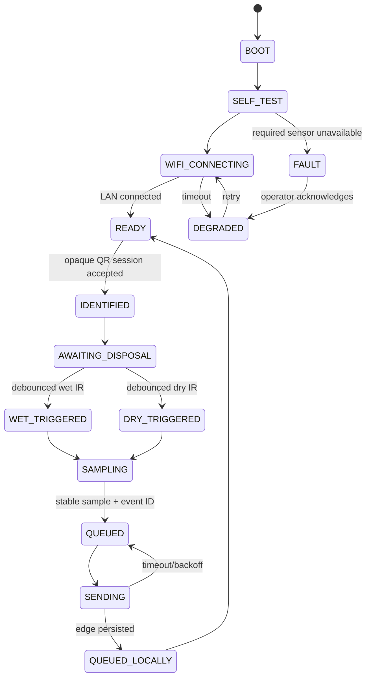

> **PLAN & STRUCTURE LOCK — v2.0:** This approved scope, stack, repository structure, contracts, ownership map, truth-tier model, and delivery plan must not be changed by contributors or AI agents. Work only inside assigned paths. If a change is necessary, stop and submit a `CHANGE_REQUEST`; only PARTH AJMERA may approve it, followed by an ADR, contract/document updates, and team notification.

# ESP32 Hardware and Firmware Specification

Owners: KRISHNA PANWAR (hardware/firmware) and ADITYA SILSWAL (edge integration)
Interface authority: `06_API_IOT_CONTRACT.md`
Rule: only a physically observed ESP32 event may use `eventSource: "HARDWARE"`. Recorded, simulated, and seeded events use `RECORDED_HARDWARE`, `SIMULATED`, and `SEEDED` respectively; ML evidence has its separate source enum.

## Tier 1 hardware gate before coding

KRISHNA PANWAR must inventory every available part at H0 and mark it `CONFIRMED`, `SUBSTITUTE`, or `MISSING`. A component is not in the live-demo path until it has a photo, part number, power requirement, and standalone reading. Missing hardware uses the approved emulator with `eventSource=SIMULATED` and UI badge `SIMULATED`; nobody fabricates a successful hardware claim.

## Approved BOM tiers

### Tier 1 — must work for the judged vertical slice

| Part | Purpose | Acceptance evidence |
|---|---|---|
| ESP32 DevKit | Controller and Wi-Fi client | Stable boot, unique device ID, heartbeat for 10 minutes |
| Printed opaque citizen QR + municipal scanner | Citizen/session identity | Five scans resolve the fictional citizen without exposing PII in the QR payload |
| IR break-beam/proximity sensor ×2 | One independent disposal trigger per wet/dry compartment | Each compartment passes five deposits without a false double event or cross-trigger |
| Ultrasonic sensor ×2 | One fill-level reading per compartment | Empty/full calibration, bounded percentage, and invalid-reading state demonstrated for both compartments |
| Capacitive moisture sensor ×1 | Supporting evidence in the dry path only | Dry/elevated/high calibration bands are stored and repeatable |
| NEO-6M or compatible GPS | Device location and fix health | Real fix or honest `MISSING`/`DEGRADED`/no-fix state reaches the edge |
| Laptop/phone hotspot | Local network | ESP32 reaches edge `/healthz`/ingest target reliably |
| Stable 5 V supply and common ground | Safe operation | No brownout during Wi-Fi transmit and sensor sampling |

The two IR sensors are **not** a sequential start/confirm pair. Wet IR and dry IR are independently debounced. The triggered sensor identifies the physical compartment for that event and must agree with the active disposal session; a disagreement is recorded for review, never silently rewritten.

Ultrasonic readings are fill telemetry only. GPS and fill level never classify waste or change points. Moisture is contextual evidence and never proves a violation by itself. Component health uses only `OK`, `DEGRADED`, `MISSING`, `FAILED`, or `UNKNOWN`; an indoor GPS no-fix is valid evidence, not a fabricated coordinate.

### Tier 1 local vision companion

The phone IP-camera or laptop camera and pinned local model are Tier 1, but they are controlled by the FastAPI edge gateway rather than the ESP32. Firmware supplies the stable `eventId` and durable sensor event; the edge performs bounded capture and inference as specified in `08_EDGE_GATEWAY.md` and `21_ML_INTEGRATION.md`. ESP32 acknowledgement never waits for ML.

### Optional hardware enhancement

| Part | Purpose | Fallback |
|---|---|---|
| MFRC522 RFID reader | Secondary household identifier after QR works | Opaque QR remains the Tier 1 identity path |
| Load cell + HX711 | Additional weight evidence | Omit with `NOT_PRESENT`; rules-2.0.0 does not require weight |
| OLED/display | Local operator feedback | Operator web UI on laptop/phone |
| Buzzer and status LED | Immediate accepted/warning/error feedback | Serial and operator UI state |

### Tier 3 — roadmap only

Dedicated edge-AI camera hardware, autonomous sorting/compactor actuation, gas/temperature/flame expansion, LoRa, 4G, solar backup, and additional compartments are roadmap only. Live local inference on the approved phone/laptop camera is Tier 1 and must not be described as roadmap.

## Safe reference pin map

This is the v2.0 baseline for a common ESP32 DevKit V1. KRISHNA PANWAR must verify the exact board labels and document any approved substitution before wiring.

| Module | ESP32 pin | Electrical note |
|---|---:|---|
| Moisture analog | GPIO34 | ADC1 input; input-only; suitable while Wi-Fi is active |
| IR wet compartment | GPIO27 | Use pull-up/pull-down appropriate to module; independently debounced |
| IR dry compartment | GPIO14 | Use pull-up/pull-down appropriate to module; independently debounced |
| Ultrasonic wet trigger | GPIO26 | Fill telemetry only |
| Ultrasonic wet echo | GPIO25 | **Use a voltage divider/level shifter; never feed 5 V directly** |
| Ultrasonic dry trigger | GPIO33 | Fill telemetry only |
| Ultrasonic dry echo | GPIO32 | **Use a voltage divider/level shifter; never feed 5 V directly** |
| GPS ESP32 RX | GPIO16 | UART2, connect to GPS TX |
| GPS ESP32 TX | GPIO17 | UART2, connect to GPS RX if needed |
| Status LED | GPIO13 | Use current-limiting resistor |

HC-SR04-class sensors typically use 5 V and **both** echo lines must be level shifted. Verify IR module output is no more than 3.3 V at the ESP32 input. Sensors and ESP32 share ground. Motors, compactors, pumps, or high-current loads must never be powered from ESP32 GPIO or the board regulator. Optional RFID/load-cell wiring requires a reviewed alternate pin map; contributors must not silently reuse the Tier 1 pins above.

## Physical build rules

- Keep wet-waste contact surfaces mechanically separated from electronics.
- Use strain relief for sensor wires and an enclosure for the controller.
- Power off before rewiring.
- Do not operate an actual compactor from this prototype controller.
- Emergency/fire signals are safety alerts and never classification evidence.
- Record a labelled wiring photo and pin table in the KRISHNA PANWAR PR.

## Firmware state machine



`QUEUED_LOCALLY` means the local edge gateway durably persisted the event; it does not mean the cloud processed it. `ACKED` is reserved for the edge outbox state after a valid cloud receipt is persisted. The operator UI displays local and cloud status separately.

## Sampling rules

1. Debounce wet and dry IR independently. One compartment trigger inside one active session creates one event; repeated edges inside the debounce/session lockout reuse or ignore the same event rather than creating a duplicate.
2. Record `triggeredCompartment` from the physical IR channel. Do not substitute the UI-selected compartment when the two disagree.
3. Capture a short bounded sensor window, reject impossible values, and store median plus min/max where useful.
4. Convert dry-path moisture ADC into calibrated percentage; retain raw ADC, quality, and calibration version. Apply `<30`, `30–45`, and `>45` only in `rules-2.0.0`, never in firmware.
5. Compute each ultrasonic fill percentage from calibrated empty/full distance, clamp valid output to `0..100`, and report invalid/timeout/divide-by-zero separately. Fill never affects segregation.
6. Emit GPS coordinates only with fix/accuracy/time quality. No-fix emits health metadata and no invented coordinate.
7. Generate `eventId` before the first send and reuse it for sensor evidence, edge camera correlation, and every retry.
8. Emit the frozen envelope fields `schemaVersion`, `messageId`, `messageType`, `deviceCode`, `bootId`, `sequence`, `occurredAt`, `timeQuality`, `firmwareVersion`, `payload`, and `extensions` exactly as defined in `06_API_IOT_CONTRACT.md`.
9. Never run business rules, ML, point, review, or penalty logic on the device. Firmware emits authenticated evidence only.

## Calibration record

Each calibrated sensor needs a versioned JSON or Markdown record containing:

- Sensor model/serial label and ESP32 device ID.
- Date, operator, firmware commit, supply voltage, and environment.
- Raw readings for at least three known points.
- Derived offset/scale/threshold and units.
- Expected tolerance and fail/degraded limits.
- Photo/video or serial-log evidence path.

Calibration data is loaded as device configuration and its version is included in collection evidence. A rule cannot claim confidence from an uncalibrated sensor.

## Firmware module boundaries

```text
firmware/esp32/
├── include/
│   ├── app_config.h
│   ├── contract_types.h
│   ├── device_state.h
│   └── sensor_interfaces.h
├── src/
│   ├── main.cpp
│   ├── connectivity.cpp
│   ├── event_builder.cpp
│   ├── optional_rfid_reader.cpp
│   ├── compartment_ir.cpp
│   ├── moisture_sensor.cpp
│   ├── ultrasonic_fill.cpp
│   ├── gps_sensor.cpp
│   └── optional_weight_sensor.cpp
├── test/
│   ├── test_event_builder.cpp
│   └── fixtures/
├── platformio.ini
└── README.md
```

`main.cpp` coordinates modules; it does not contain sensor drivers or JSON assembly. Wi-Fi secrets live outside source. `event_builder` is the only module that shapes the v1 payload.

## Serial log format

```text
SGV|INFO|device=esp32-sgv-01|state=READY|fw=1.0.0
SGV|EVENT|eventId=<uuid>|state=QUEUED|sequence=42
SGV|SYNC|eventId=<uuid>|edge=QUEUED_LOCALLY|http=202
SGV|EVENT|eventId=<uuid>|compartment=DRY|trigger=IR_DRY|eventSource=HARDWARE
SGV|WARN|sensor=moisture|state=DEGRADED|reason=OUT_OF_RANGE
SGV|WARN|sensor=gps|state=DEGRADED|reason=NO_FIX
```

Never print Wi-Fi passwords, device secrets, citizen name/address, or full RFID UID. Log the server-safe identifier reference/hash.

## Hardware acceptance checklist

- [ ] Board boots without brownout for 10 minutes.
- [ ] Opaque QR maps only to a fictional seeded citizen and contains no PII.
- [ ] Wet and dry IR debouncing each pass five trials without double or cross-trigger.
- [ ] Dry-path moisture samples repeatably map to normal, elevated, and high bands.
- [ ] Both ultrasonic sensors report calibrated fill and honest invalid/timeout states.
- [ ] GPS reports a real fix with quality or an honest no-fix/degraded state.
- [ ] Heartbeat reaches edge at the configured interval.
- [ ] Valid v1 event is acknowledged and visible in edge queue.
- [ ] Disconnecting Wi-Fi does not create duplicate IDs after reconnect.
- [ ] Every component disconnect produces `DEGRADED`, `MISSING`, or `FAILED`, not fabricated zero/normal.
- [ ] Hardware source is visually distinguishable from emulator source.
- [ ] Edge acknowledgement remains successful when camera/model inference is unavailable.

## Ownership handshake

KRISHNA PANWAR delivers the canonical hardware JSON payload plus serial evidence to ADITYA SILSWAL. ADITYA SILSWAL verifies durable ingest and `eventId`-correlated camera orchestration at the edge boundary. AASHU JOSHI consumes the same fixture through cloud ingestion and `rules-2.0.0`. Contract mismatches are not fixed by private variations; they stop at `packages/contracts` and go through PARTH AJMERA.
