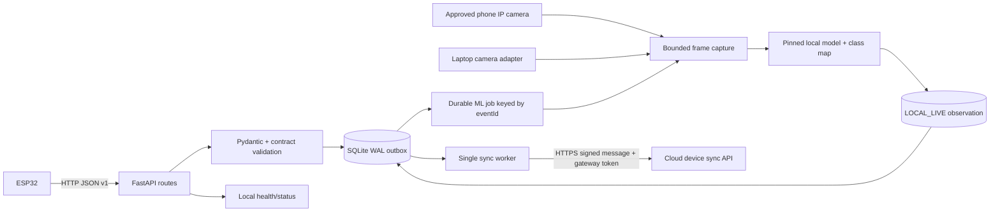

> **PLAN & STRUCTURE LOCK — v2.0:** This approved scope, stack, repository structure, contracts, ownership map, truth-tier model, and delivery plan must not be changed by contributors or AI agents. Work only inside assigned paths. If a change is necessary, stop and submit a `CHANGE_REQUEST`; only PARTH AJMERA may approve it, followed by an ADR, contract/document updates, and team notification.

# Local Edge Gateway Specification

Owner: ADITYA SILSWAL
Device collaborator: KRISHNA PANWAR
Cloud collaborator: AASHU JOSHI
Canonical payloads: `06_API_IOT_CONTRACT.md` and `packages/contracts/**`

## Purpose

The edge gateway is the reliable boundary between unstable physical/network conditions and the cloud platform. It accepts authenticated ESP32 messages over the private LAN, validates them, durably persists them in SQLite, acknowledges local custody, then synchronizes them to the cloud without duplication. After durable ingest, it also orchestrates the Tier 1 local camera and pinned inference runtime, correlated by the same `eventId`.

It may create a provenance-rich ML observation with source `LOCAL_LIVE`; it does **not** make the business segregation decision, award or deduct points, create a verified violation, call Supabase directly, or contain citizen/admin business logic. Those decisions remain in the versioned cloud rules/review flow.

## Runtime topology



## Service modules

```text
services/edge-gateway/app/
├── api/             versioned device ingest, heartbeat, health, queue status
├── auth/            device authentication and request verification
├── contracts/       generated/mirrored Pydantic models verified by fixtures
├── domain/          local message/receipt state types only
├── persistence/     SQLite connection, migrations, repositories, leasing
├── ml/              camera adapters, model manifest verification, inference, class mapping
├── services/        ingest/ML orchestration, sync worker, backoff, cleanup
├── settings.py      validated environment configuration
└── main.py          FastAPI composition/lifespan only
```

## Local endpoints

| Method/path | Caller | Result |
|---|---|---|
| `GET /healthz` | operator/monitor | Liveness/readiness summary without secrets |
| `POST /v1/ingest/heartbeats` | ESP32 | Persists/updates device health; returns local receipt |
| `POST /v1/ingest/collection-events` | ESP32 | Validates and durably inserts event before `202` |
| `POST /v1/ingest/gps` | ESP32 | Validates/persists location sample |
| `POST /v1/ingest/telemetry` | ESP32 | Validates/persists operational telemetry |
| `GET /v1/device/config` | ESP32 | Approved non-secret device configuration/version |
| `GET /v1/messages/{messageId}` | signed device/status flow | Cloud result or transport state |

Exact request/response shapes and error codes come only from `06_API_IOT_CONTRACT.md`.

The camera stream URL is configuration, not API input. No LAN or cloud caller may supply an arbitrary capture URL, model path, command, or class map in a request.

## Acknowledgement rule

`202 QUEUED_LOCALLY` may be returned only after the transaction containing the unique message and payload hash commits successfully. Memory, a Python queue, or “request received” log is not durable acknowledgement.

Camera capture and inference start only after that commit and never delay or invalidate `202 QUEUED_LOCALLY`. Camera timeout, corrupt frame, model-load failure, inference error, low confidence, or unsupported class records `ML_UNAVAILABLE` or an uncertain observation and leads to `FLAGGED` in cloud processing. The original hardware event remains durable and eligible for synchronization.

Duplicate behavior:

- Same `messageId` (scoped to `deviceCode`) and same payload hash: return the original local receipt; no second row.
- Same `messageId` with a different hash: `409 IDEMPOTENCY_CONFLICT`, quarantine/audit; never overwrite.
- Invalid/auth-failed payload: never place in the normal outbox.

## SQLite model

`05_DATA_SCHEMA.md` is authoritative. Do not create a competing table set. Its canonical minimum is:

- `local_events`: durable device event plus event source, request hash, local ML processing state/attempt/deadline/lease, safe failure code, and timestamps;
- `local_ml_results`: append-only local result and provenance, including evidence source, input hash, model/weights/class-map identity, supported class/category/confidence, latency, and timestamp; never a raw frame;
- `outbox_messages`: immutable exact cloud body/hash plus transport state, attempt/backoff/lease, safe error, cloud receipt, and timestamps;
- `device_replay_keys`: device/boot/sequence identity, request hash, and stable replay response.

Heartbeat/telemetry uses the same durable event/outbox contracts rather than an unapproved parallel business store. Dead-letter, auth-blocked, and cloud receipt information stays in `outbox_messages`; migration files own schema versioning.

Use WAL mode, foreign keys, busy timeout, and `synchronous=FULL` for the judged profile. A processing worker and the sync worker each claim their own rows atomically with bounded leases. A crashed/expired lease returns to retry.

Enforce one canonical live observation per approved event/model attempt identity. Duplicate IR delivery or process restart resumes the durable job; it does not recapture indefinitely or create duplicate observations. Same identity plus changed content is quarantined as an integrity conflict.

## Message state machine

```mermaid
stateDiagram-v2
  [*] --> PENDING: committed locally
  PENDING --> IN_FLIGHT: leased by worker
  IN_FLIGHT --> ACKED: cloud receipt persisted
  IN_FLIGHT --> PENDING: transient failure; nextAttemptAt set
  IN_FLIGHT --> AUTH_BLOCKED: 401/403
  IN_FLIGHT --> DEAD_LETTER: terminal schema/business rejection
  AUTH_BLOCKED --> PENDING: credentials repaired by human
  DEAD_LETTER --> PENDING: explicit approved remediation
```



Never delete a failed record to make status green.

## Local ML processing state

Processing and transport are orthogonal; never add ML states to the outbox enum. `CAPTURING` and `INFERRING` may appear as tracing spans or safe log events, but they are not additional persisted canonical states.

```mermaid
stateDiagram-v2
  [*] --> ML_PENDING: hardware event committed
  ML_PENDING --> ML_RECEIVED: capture, inference, and observation commit succeed
  ML_PENDING --> ML_UNAVAILABLE: adapter/model/frame failure or deadline
  ML_PENDING --> ML_PENDING: expired processing lease; bounded retry
```



An observation arriving after the event's ML deadline is stored as late evidence with full provenance. It cannot silently reopen a closed decision, mutate a ledger entry, or replace the canonical observation; any later use requires the approved review flow.

## Camera and model controls

- Support exactly two adapter types: a direct laptop camera device and an H0-approved phone IP-camera endpoint.
- The phone endpoint must be a startup-configured exact scheme/host/IP/port/path allowlist. Permit only `http`/`https`, reject embedded credentials, disable redirects, revalidate the resolved destination, and deny every host/port not explicitly approved. Because the intended camera is on the private LAN, use a narrow positive allowlist rather than a generic “allow private IPs” rule.
- Never accept a camera URL, local file path, model path, or subprocess argument from an HTTP payload. Do not forward browser/device credentials to the camera.
- Use short connect/read/total timeouts, a strict maximum frame size and decoded dimensions, and at most the configured bounded capture attempts per event.
- Keep the frame in memory only long enough to hash and infer. Raw frames are not written to SQLite, cloud storage, logs, screenshots, or the repository by default.
- Debug retention is disabled by default. If PARTH AJMERA explicitly enables it, use only synthetic/team-consented imagery, an isolated non-web-served directory, opaque filenames, restricted permissions, and automatic expiry.
- Load only the operator-provisioned model named by the checked-in manifest. Verify its SHA-256, framework version, class-map version, provenance, and recorded license decision before readiness becomes green. Never download or deserialize request-selected weights at runtime.
- Prefer in-process inference. If isolation requires a worker subprocess, use a fixed executable and fixed argument array, `shell=false`, no request-derived values, bounded CPU/memory/time, and a least-privilege OS account.
- Map only manifest-supported classes to `WET` or `DRY`; every unsupported label is `UNKNOWN`. Multiple conflicting objects are uncertain rather than silently reduced to the highest score.
- Confidence bands are `<0.60 LOW`, `0.60–<0.85 MEDIUM`, and `>=0.85 HIGH`; the score is not called a calibrated probability unless validation proves it.

## Simulation boundary

The cloud's developer test-event endpoint joins after physical ingest. It is not an ESP32 or camera route and cannot produce `eventSource=HARDWARE` or ML `evidenceSource=LOCAL_LIVE`. A developer test event uses `eventSource=SIMULATED` and `evidenceSource=SIMULATED`. An approved recorded fallback uses `eventSource=RECORDED_HARDWARE` with `evidenceSource=RECORDED_ML`. Seed history uses `SEEDED` in both applicable provenance fields. None counts as real-hardware proof.

Simulation requires `DEMO_SIMULATION_ENABLED=true`, an authorized system-admin/developer, a fixed fictional citizen/device, idempotency and rate limits, and an audit entry. No public “simulate URL” or arbitrary fixture path is permitted. UI maps the canonical provenance only to `REAL`, `RECORDED`, `SIMULATED`, or `PREVIEW/SEEDED`; a Tier 2 preview is a frontend fixture and is never persisted by the edge.

## Retry policy

- Connection errors, timeout, `408`, `429`, and `5xx`: exponential backoff with jitter, capped at 60 seconds in demo profile.
- `401/403`: stop aggressive retry; show `AUTH_BLOCKED` until credential/config repair.
- Exact retry with a valid HTTP `200` stored result: persist the receipt and mark `ACKED`.
- `409 IDEMPOTENCY_CONFLICT`: dead-letter and raise a security/audit alert; never mark `ACKED`.
- `422` payload/contract mismatch: dead-letter with safe reason.
- Cloud sync v1 sends one durable message per request. A small bounded worker pool may increase concurrency; batching requires a future approved contract.
- All timeouts are explicit. An unknown cloud outcome is retried with the same idempotency identity.

## Health response requirements

Readiness must report, without secrets:

- service version and contract version;
- SQLite writable/schema status;
- sync worker running/last loop;
- cloud reachable/last successful sync age;
- pending, in-flight, auth-blocked, and dead-letter counts, plus scheduled retry timing;
- latest device heartbeat age and sensor health summary;
- disk free-space warning;
- camera adapter readiness without exposing its URL/credentials;
- model manifest/version, verified weights-hash suffix, license-gate status, and supported class-map version;
- ML pending/in-flight/unavailable counts, last inference age, and measured capture/inference latency.

Use `200` ready and `503` not-ready. Liveness remains `200` while the process can respond, even when cloud is offline.

## Configuration

Validate environment at startup and fail closed for missing production secrets. Required: host/port, DB path, cloud base URL, cloud token, supported contract version, request size, timeouts, retry limits, log level, camera adapter/allowlist, capture limits, model manifest path, expected weights hash, class-map version, and ML deadline. Secrets and full camera URLs are redacted and never returned by config/health endpoints.

## Testing acceptance

- Valid/invalid canonical fixtures match contract behavior.
- Kill process immediately after `202`; restart recovers event.
- Queue 20 events with cloud offline; restart; reconnect; all reconcile once.
- Replay same event/payload; one local/cloud event and credit.
- Same ID/different body; quarantined mismatch.
- Cloud 429/500 retries; 401 pauses; 422 dead-letters.
- Two attempted worker instances cannot process one row concurrently.
- Health truthfully distinguishes process, DB, cloud, queue, and device state.
- Durable ingest returns `202` even when the camera or model is intentionally unavailable; the event later carries `ML_UNAVAILABLE` and is `FLAGGED`, not lost.
- Wet and dry IR duplicates correlate to one event/ML job; a restart during capture or inference resumes safely.
- Phone-camera SSRF tests reject unconfigured hosts, ports, schemes, credentials, redirects, DNS changes, metadata targets, and oversized frames.
- Startup rejects altered weights, manifest/class-map mismatch, missing provenance, or an unresolved license decision.
- Unsupported labels, low confidence, and conflicting objects return an uncertain observation and never a negative ledger mutation.
- Raw frames never appear in SQLite, normal logs, cloud payloads, git, or web-served directories.
- Simulation is disabled by default, role-gated, rate-limited, idempotent, audited, and unmistakably labelled.

## Operator run commands

Root scripts are authoritative when created:

```bash
npm run dev:edge
npm run test:edge
npm run edge:status
npm run edge:queue
```

The service must shut down gracefully: stop accepting new sync leases, finish/cancel bounded in-flight HTTP, persist state, and close SQLite.
