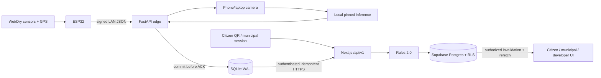

> **PLAN & STRUCTURE LOCK — v2.0:** This approved scope, stack, repository structure, contracts, ownership map, truth-tier model, and delivery plan must not be changed by contributors or AI agents. Work only inside assigned paths. If a change is necessary, stop and submit a `CHANGE_REQUEST`; only PARTH AJMERA may approve it, followed by an ADR, contract/document updates, and team notification.

# Smart Waste Ecosystem

An ESP32-powered, offline-resilient waste-disposal platform that connects an opaque citizen QR, wet/dry compartment sensors, local camera inference, explainable segregation rules, and an append-only citizen point ledger to live citizen, municipal, and developer views.

Repository: `Vortex-ParthAjmera/Smart-Waste-Ecosystem`
Team: TLE Eliminators
Target: SIH 2026 university-level hackathon
Build profile: approved 30-hour / six-person baseline v2.0

## Why this project is different

Most smart-waste prototypes demonstrate only fill level or a dashboard. This project demonstrates one auditable disposal event from physical trigger to digital outcome:

```text
opaque QR + selected wet/dry compartment
  -> ESP32 IR/fill/moisture/GPS health
  -> durable FastAPI + SQLite edge custody
  -> event-correlated phone/laptop camera capture
  -> pinned local model + supported-class mapping
  -> authenticated duplicate-safe cloud sync
  -> ACCEPTED (+10) or FLAGGED (human review)
  -> citizen, municipal, and developer proof
```

The fairness rule is simple: a supported, qualifying match may earn `+10` automatically. A model/sensor mismatch never deducts points automatically. Review may clear it with `REVIEW_ACCEPTED`, close insufficient evidence at zero with `REVIEW_NO_ACTION`, or—only through a recorded human `VERIFIED_VIOLATION`—append `-10` or `-20`. A dispute/reversal preserves the full ledger history.

## Truth tiers

| Tier | What it means | Included examples |
|---|---|---|
| Tier 1 — `REAL` | Implemented, tested, and honestly demonstrated | ESP32, local edge, local inference, event/ledger/review, role UIs, health, seed, guarded simulation |
| Tier 2 — `PREVIEW` | Permanently labelled static/seeded UI; no dedicated backend | map/ETA, multi-truck cards, discount preview, full reports, status stepper |
| Tier 3 — `ROADMAP` | Documented only | dedicated AI camera, MQTT fleet, routing/geofence, real billing/UPI, government identity |

Tier 2 never receives a table, endpoint, worker, or “live” claim. Simulation is functional Tier 1 insurance but every related record displays `SIMULATED` and cannot count as hardware evidence.

## Tier 1 capabilities

### Citizen

- Supabase session with phone-OTP target and fictional account fallback.
- Opaque, expiring/rotatable QR containing no PII.
- Own disposal history and live result.
- Ledger-derived point balance and transaction reasons.
- Bronze/Silver/Gold/Platinum tier, limited demo badges, and fictional opt-in alias leaderboard.
- Own reviewed negative entry and dispute status.

### Municipal

- Google OAuth target with fictional account fallback.
- QR scan, minimum safe citizen confirmation, device/compartment session binding.
- Active disposal timeline and result.
- Authorized flagged-event evidence and human review.
- Review-accepted `+10`, no-action closure at zero, or verified `-10/-20`; no direct balance edit.

### Developer / IoT

- Device, individual sensor, edge, SQLite queue, camera, model, WAN, cloud, and Realtime health.
- Authorized raw technical telemetry and model provenance/latency/status.
- Safe structured diagnostic summaries.
- Guarded demo-only “Inject Test Event” using allowlisted fixtures and fixed fictional identities.

### Hardware and local intelligence

- One ESP32 DevKit.
- Wet and dry compartments.
- One independently debounced IR trigger per compartment.
- One ultrasonic fill sensor per compartment.
- One calibrated moisture sensor in the dry path.
- GPS fix/quality and component heartbeat.
- Phone IP-camera or laptop camera frame burst.
- Pre-downloaded pinned YOLOv8n-compatible local inference on the team laptop.
- Explicit supported-class map; unsupported/no/multiple/low-score items become `UNKNOWN`/review.

## Architecture



When WAN is unavailable, the ESP32, camera, local inference, and edge persistence continue on the LAN. Cloud pages remain stale until the outbox synchronizes. The project does not claim that Supabase/Vercel/managed auth works without internet.

## Frozen decision policy

`rules-2.0.0` uses:

- model-score bands: `<0.60 LOW`, `0.60–<0.85 MEDIUM`, `>=0.85 HIGH`;
- calibrated dry-path moisture: `<30% NORMAL`, `30–45% ELEVATED`, `>45% HIGH`;
- correct supported match: automatic `ACCEPTED`, exactly one `+10`;
- low/unknown/multiple/model failure/sensor degradation/mismatch/high dry moisture: `FLAGGED`, immediate `0`;
- environmental wetting: `FLAGGED`, immediate `0`, never an automatic adverse action;
- reviewer-confirmed normal mismatch: `-10`;
- reviewer-confirmed severe wet-in-dry: `-20`;
- correction: compensating ledger transaction, never row mutation.

Full matrix: [Waste Decision, Points, and Review Rules](https://github.com/Vortex-ParthAjmera/Smart-Waste-Ecosystem/blob/main/DOCUMENTATION/22_WASTE_DECISION_POINTS.md).

## Repository structure

```text
apps/web/                  one Next.js app: citizen, municipal, developer, /api/v1
services/edge-gateway/     FastAPI, SQLite, capture/inference, outbox, health
firmware/esp32/            sensors, calibration, debounce, heartbeat, signed LAN client
packages/contracts/        JSON Schema, OpenAPI, golden fixtures, shared types
packages/rules-engine/     pure deterministic rules-2.0.0
supabase/                  forward-only migrations, RLS tests, deterministic seed
tests/                     contract, integration, E2E, HIL
scripts/                   setup, model manifest, fixtures, seed/reset, verification
DOCUMENTATION/             approved product/engineering/operations pack
```

Do not create separate `apps/citizen`, `apps/municipal`, `apps/developer`, top-level `ml`, or direct Supabase firmware paths. Read [Repository Structure](https://github.com/Vortex-ParthAjmera/Smart-Waste-Ecosystem/blob/main/DOCUMENTATION/04_REPOSITORY_STRUCTURE.md) before scaffolding.

## Team ownership and branches

| Member | Responsibility | Branch |
|---|---|---|
| PARTH AJMERA | product, governance, contracts, integration, release, demo | `team/parth-ajmera-governance` |
| YASHVARDHAN DOBHAL | all web role experiences and accessible UI; Cursor workflow | `team/yashvardhan-dobhal-web-ui` |
| AASHU JOSHI | cloud APIs, authorization/domain orchestration, rules engine | `team/aashu-joshi-cloud-api` |
| KRISHNA PANWAR | physical prototype and ESP32 firmware | `team/krishna-panwar-esp32` |
| ADITYA SILSWAL | FastAPI/SQLite edge, local capture/inference, sync/health | `team/aditya-silswal-edge-gateway` |
| BHUMIKA SINGH RAWAT | schema, RLS, deterministic seed, tests, CI/release evidence | `team/bhumika-singh-rawat-data-qa` |

Every team branch targets `integration`; milestone PRs move `integration` to `main`. Only Parth merges. No direct push to `main`/`integration`, no rebase/force-push on shared persistent branches.

Krishna and Aditya currently authenticate through Aditya's GitHub account, so they must use separate branches and local Git author identities. Separate GitHub accounts are recommended before final review so independent attribution/approval is possible.

## Documentation first

Start with:

1. [Documentation Control Centre](https://github.com/Vortex-ParthAjmera/Smart-Waste-Ecosystem/blob/main/DOCUMENTATION/00_READ_ME_FIRST.md)
2. [Product Requirements](https://github.com/Vortex-ParthAjmera/Smart-Waste-Ecosystem/blob/main/DOCUMENTATION/01_PRODUCT_REQUIREMENTS.md)
3. [Architecture](https://github.com/Vortex-ParthAjmera/Smart-Waste-Ecosystem/blob/main/DOCUMENTATION/02_SYSTEM_ARCHITECTURE.md)
4. [Repository Structure](https://github.com/Vortex-ParthAjmera/Smart-Waste-Ecosystem/blob/main/DOCUMENTATION/04_REPOSITORY_STRUCTURE.md)
5. [Schema](https://github.com/Vortex-ParthAjmera/Smart-Waste-Ecosystem/blob/main/DOCUMENTATION/05_DATA_SCHEMA.md)
6. [API/IoT Contract](https://github.com/Vortex-ParthAjmera/Smart-Waste-Ecosystem/blob/main/DOCUMENTATION/06_API_IOT_CONTRACT.md)
7. [30-Hour Plan](https://github.com/Vortex-ParthAjmera/Smart-Waste-Ecosystem/blob/main/DOCUMENTATION/10_IMPLEMENTATION_PLAN.md)
8. [Build Doc v4 Reconciliation](https://github.com/Vortex-ParthAjmera/Smart-Waste-Ecosystem/blob/main/DOCUMENTATION/23_BUILD_DOC_V4_RECONCILIATION.md)

Coding agents receive only root `AGENTS.md` plus one scoped issue prompt. They do not receive the Build Doc v4 source as an instruction file.

## Prerequisites

Install and verify before H0:

- Git and access to the private repository;
- Node.js/npm version selected and pinned by the scaffold;
- Python 3.12-compatible runtime;
- PlatformIO and the target ESP32 board toolchain;
- Supabase CLI if local schema/reset workflows use it;
- supported browser plus separate demo profiles;
- ESP32, IR x2, ultrasonic x2, dry-path moisture sensor, GPS, wiring/power;
- phone/laptop camera accessible on the isolated demo LAN;
- reviewed model runtime, weights, class map and hash downloaded before the demo.

Exact dependency versions are committed during G0. Do not independently install “latest” packages.

## Environment contract

Create local ignored environment files from `.env.example`. Expected categories—not secret values—include:

```text
# Next.js/Supabase
NEXT_PUBLIC_SUPABASE_URL
NEXT_PUBLIC_SUPABASE_ANON_KEY
SUPABASE_SERVICE_ROLE_KEY

# Gateway/cloud signing
SGV_GATEWAY_ID
SGV_GATEWAY_SECRET
SGV_DEVICE_API_BASE_URL

# Edge LAN/device
SGV_EDGE_HOST
SGV_EDGE_PORT
SGV_DEVICE_SECRETS_FILE
SGV_EDGE_DB_PATH

# Camera/model (edge only)
SGV_CAMERA_SOURCE
SGV_CAMERA_SOURCE_KIND
SGV_MODEL_PATH
SGV_MODEL_MANIFEST_PATH
SGV_CLASS_MAP_PATH

# Demo guard
DEMO_SIMULATION_ENABLED
```

Never commit actual tokens, service keys, camera credentials/URLs, QR values, device secrets, database files, raw frames, or unapproved model weights. Never use `NEXT_PUBLIC_*` for privileged secrets.

## Scaffold and development workflow

The repository currently begins with the approved documentation baseline. After the G0 scaffold PR creates the frozen tree and scripts, the canonical workflow is:

```bash
npm ci
npm run lint
npm run typecheck
npm test
npm run build
```

Edge, firmware, database, and E2E commands are defined in the root scripts/runbooks after scaffold. Do not invent alternate commands or package managers; use the command contract in root `AGENTS.md` and `DOCUMENTATION/13_DEPLOYMENT_RUNBOOK.md`.

## Definition of demo-ready

- [ ] real QR/session binds one selected compartment event;
- [ ] real ESP32 readings and health reach durable SQLite before ACK;
- [ ] selected IR automatically triggers event-correlated local capture/inference;
- [ ] supported match syncs once and appends one `+10`;
- [ ] low/mismatch/environmental/model/sensor failure flags with zero automatic negative;
- [ ] reviewer can create audited `-10/-20`, citizen can dispute, reversal compensates;
- [ ] citizen, municipal, developer UIs show correct role/source/stale states;
- [ ] three offline events survive restart/reconnect without duplicates;
- [ ] simulation is guarded and visibly `SIMULATED`;
- [ ] seed totals/badges/leaderboard reconcile and all people are fictional;
- [ ] no Tier 2 backend exists and every preview is labelled;
- [ ] three consecutive rehearsals and release checks pass.

## Honest claims

Safe:

- real ESP32 and local sensor capture;
- durable offline edge custody and later sync;
- real local event-correlated model execution for the tested class set;
- explainable rules and immutable point ledger;
- human verification before negative points;
- role authorization/RLS tested on fictional data;
- Tier 2 screens are roadmap previews.

Do not claim:

- arbitrary-waste or production model accuracy;
- legal proof, automatic guilt, real fines, billing, discounts, UPI, or municipal integration;
- true live truck tracking when showing a preview animation;
- full internet independence for cloud/auth/realtime;
- autonomous sorting, route optimization, multi-city scale, or production security certification.

## License

Repository licensing is governed by [LICENSE](https://github.com/Vortex-ParthAjmera/Smart-Waste-Ecosystem/blob/main/LICENSE). Third-party code, model runtime, weights, and dataset/artifact rights must be reviewed separately and recorded in the model manifest; the repository license does not automatically grant rights to external model artifacts.
