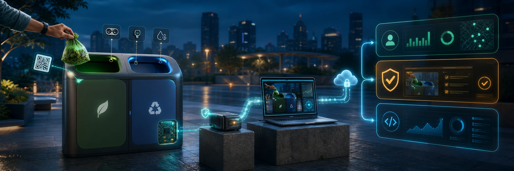
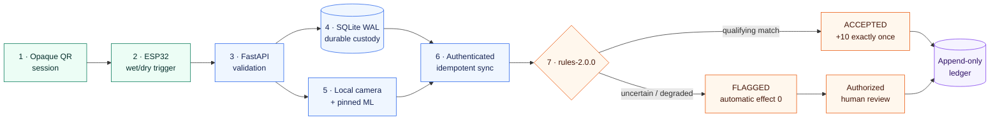
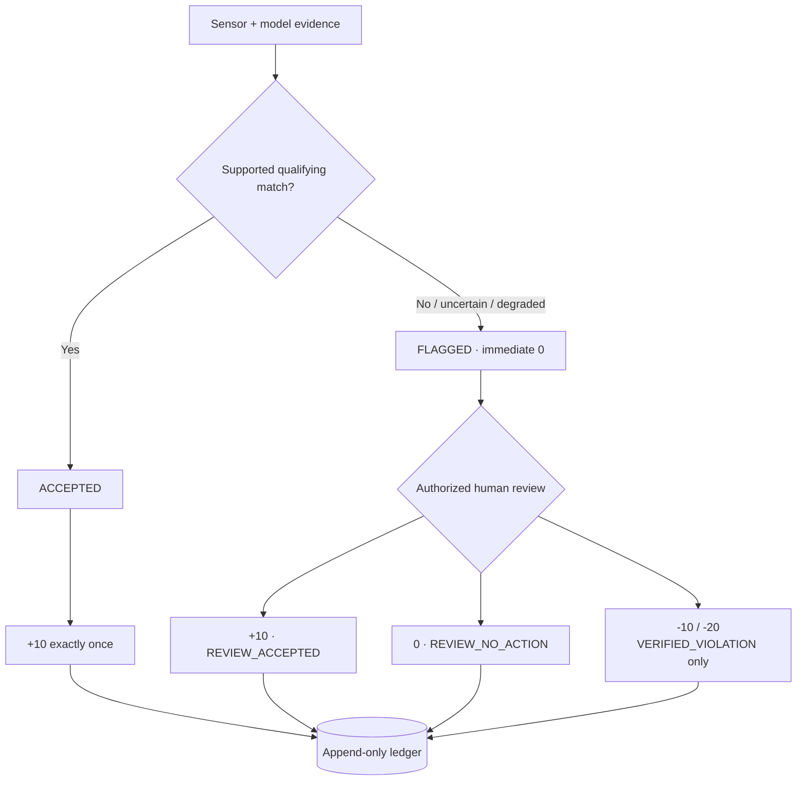

<p align="center">
  
</p>

<h1 align="center">SGV 2.0 · Smart Waste Ecosystem</h1>

<p align="center">
  <strong>From one physical bin event to a fair, auditable EcoCredit—even when the network drops.</strong>
</p>

<p align="center">
  An offline-resilient waste-disposal prototype connecting an opaque citizen QR, ESP32 sensors,
  local edge custody, bounded ML evidence, deterministic rules, and human-governed review.
</p>

<p align="center">
  <a href="https://github.com/Vortex-ParthAjmera/Smart-Waste-Ecosystem/actions/workflows/ci.yml"></a>
  
  
  
  
  <a href="./LICENSE"></a>
</p>

<p align="center">
  <a href="#run-the-web-demo">Run locally</a> ·
  <a href="#what-works-today">Current status</a> ·
  <a href="#one-disposal-complete-proof">Architecture</a> ·
  <a href="#documentation">Documentation</a>
</p>

> [!IMPORTANT]
> **Current state:** the fixture-first web experience is runnable today, the rules/contracts and durable edge-ingest foundations are implemented, and the remaining hardware → camera/ML → cloud seams are still being integrated. All bundled identities and records are fictional. This README separates shipped behavior from the approved demo-ready target.

<table>
  <tr>
    <td align="center"><strong>1</strong><br />stable event identity</td>
    <td align="center"><strong>2</strong><br />wet / dry compartments</td>
    <td align="center"><strong>3</strong><br />role experiences</td>
    <td align="center"><strong>0</strong><br />automatic negative points</td>
  </tr>
</table>

## Why this exists

Most smart-waste demos stop at fill level or a dashboard. SGV 2.0 is designed around a harder question:

> Can one disposal remain traceable from the physical trigger to the final ledger entry—without letting uncertain AI evidence punish a citizen?

The system keeps sensor evidence, ML evidence, transport state, automated decisions, human review, and point transactions separate. A qualifying supported match may earn **+10 exactly once**. Uncertainty is **flagged with an immediate effect of 0**. Only an authorized human review can create a negative ledger entry.

## Run the web demo

### Prerequisites

- Node.js 20 or newer
- npm 10 or newer

### Start in under a minute

```bash
git clone https://github.com/Vortex-ParthAjmera/Smart-Waste-Ecosystem.git
cd Smart-Waste-Ecosystem
npm ci
npm run dev
```

Open [http://localhost:3000](http://localhost:3000).

The local tour uses deterministic fictional fixtures and does **not** require Supabase credentials. Connected auth, cloud persistence, edge sync, camera inference, and hardware require the environment and service setup documented in the [deployment runbook](./DOCUMENTATION/13_DEPLOYMENT_RUNBOOK.md).

### Demo access

| Experience | Route | Fictional access |
|---|---|---|
| Citizen | [`/`](http://localhost:3000/) or [`/citizen`](http://localhost:3000/citizen) | `citizen-main-fictional` / `demo-citizen-2026` |
| Municipal operator | [`/operator`](http://localhost:3000/operator) | Use **Continue with Google demo** |
| Human review | [`/review`](http://localhost:3000/review) | Municipal demo flow |
| Developer / IoT | [`/developer`](http://localhost:3000/developer) | `iot-admin` / `demo-dev-2026` |

## What works today

| Layer | Repository status | What is present |
|---|---|---|
| Web experience | **Runnable · fixture-backed** | Accessible citizen, municipal, review, developer, auth, Hindi/English, provenance, stale/degraded, and preview states |
| Rules engine | **Implemented** | Deterministic `rules-2.0.0` decisions, confidence/moisture boundaries, review outcomes, point effects, and tier projection |
| Contracts | **Implemented** | JSON Schema, OpenAPI, shared TypeScript types, and a golden disposal-event fixture |
| Edge ingest | **Partial integration** | FastAPI validation, device HMAC checks, replay/conflict handling, SQLite WAL custody, and an outbox record |
| Cloud/data | **Scaffolded** | Next.js `/api/v1` routes, Supabase adapters, migration, seed metadata, and RLS foundations; integration alignment remains |
| ESP32 firmware | **Scaffolded** | Compartment trigger and edge HTTP client foundations; production signing and full sensor payload remain |
| Camera + local ML | **Pending provisioning** | Adapter boundaries and model manifest exist; live camera capture, approved weights, and end-to-end evidence are not yet demo-ready |
| End-to-end proof | **In progress** | The complete physical-event evidence chain must still pass on the final hardware and demo environment |

## One disposal, complete proof

The approved vertical slice is narrow on purpose: prove one event reliably instead of simulating an entire city.



### Offline truth

When WAN is unavailable, the intended local path keeps the ESP32, capture/inference process, and SQLite custody on the LAN. Cloud pages cannot update until authenticated outbox sync resumes. SGV 2.0 does not claim that hosted auth, Supabase, Vercel, or Realtime work offline.

## Fairness is a system invariant



- ML and sensors provide **evidence**, not guilt.
- Fill level and GPS are operational signals, not segregation-decision inputs.
- Moisture is dry-path evidence only and never standalone proof.
- Unsupported, missing, multiple, late, or low-score detections become uncertainty.
- Balances are derived from append-only transactions; history is never rewritten.
- Disputes and reversals use compensating entries, preserving the audit trail.

See the full [decision, points, and review matrix](./DOCUMENTATION/22_WASTE_DECISION_POINTS.md).

## Role experiences

### Citizen

- opaque QR concept with no embedded PII;
- trace receipt linking event, evidence, rules, review, and ledger;
- fictional history, EcoCredit balance, tier, badges, and privacy-safe leaderboard;
- visible `REAL`, `RECORDED`, `SIMULATED`, and `PREVIEW/SEEDED` provenance.

### Municipal

- accountable disposal-session and selected-compartment workflow;
- ordered review queue with evidence provenance;
- review accepted, no-action, or verified-violation outcomes;
- no direct balance editing and no automatic penalty path.

### Developer / IoT

- component-level health and degraded-state visibility;
- edge queue, transport, model-manifest, and telemetry surfaces;
- bounded, redacted diagnostic logs;
- guarded simulation contract using allowlisted fictional fixtures.

## Truth labels

| Label | Meaning |
|---|---|
| `REAL` | Intended for verified live hardware or local-ML evidence |
| `RECORDED` | A disclosed, previously captured fallback |
| `SIMULATED` | A guarded fictional event that exercises downstream rules |
| `PREVIEW/SEEDED` | Static or seeded interface data with no dedicated live backend |

> [!NOTE]
> The current web tour is produced from committed fictional projections. A rendered `REAL` sample badge demonstrates the interface state; it is not a substitute for a timestamped physical-run evidence manifest.

## Technology

| Boundary | Technology | Responsibility |
|---|---|---|
| Web + API | Next.js 14, React 18, TypeScript, Zod | Role UI, validation, orchestration, typed API routes |
| Cloud data | Supabase Auth, Postgres, RLS, Realtime target | Identity, durable source of truth, authorization |
| Pure domain | TypeScript package | Deterministic rules and point policy |
| Edge | Python, FastAPI, Pydantic, SQLite WAL | Signed ingest, durable local custody, capture/inference orchestration |
| Device | ESP32, PlatformIO, ArduinoJson | Sensor readings, compartment trigger, signed LAN client target |
| Contracts | JSON Schema, OpenAPI, shared types | Cross-runtime compatibility |
| Verification | Vitest, pytest, PlatformIO, GitHub Actions | Unit, contract, edge, firmware, and build checks |

## Repository map

```text
apps/web/                 Next.js role experiences and /api/v1
services/edge-gateway/    FastAPI, SQLite, capture/ML boundaries
firmware/esp32/           sensor and LAN client firmware
packages/contracts/       JSON Schema, OpenAPI, fixtures, shared types
packages/rules-engine/    pure deterministic rules-2.0.0
supabase/                 migration, RLS foundations, fictional seed
scripts/                  setup, demo manifests, reset, verification
DOCUMENTATION/            product, architecture, security, test, demo pack
```

## Command reference

```bash
npm run dev           # fixture-backed web tour
npm run typecheck     # all TypeScript workspaces
npm test              # rules, contracts, and web unit tests
npm run build         # production web/workspace build
npm run test:edge     # FastAPI/SQLite tests; Python test deps required
npm run test:firmware # PlatformIO tests; toolchain required
npm run test:db       # deterministic seed-manifest verification
```

The committed `test:e2e` command is reserved for the browser suite; the Playwright dependency/configuration must be completed before treating it as a release gate.

## Configuration

The fixture-backed web tour needs no secrets. Connected services use local ignored environment files based on [`.env.example`](./.env.example).

Never commit Supabase service keys, device/gateway secrets, camera credentials, raw QR values, real PII, database files, captured frames, or unapproved model weights.

## Documentation

Start here:

1. [Documentation control centre](./DOCUMENTATION/00_READ_ME_FIRST.md)
2. [Product requirements](./DOCUMENTATION/01_PRODUCT_REQUIREMENTS.md)
3. [System architecture](./DOCUMENTATION/02_SYSTEM_ARCHITECTURE.md)
4. [Technology decisions](./DOCUMENTATION/03_TECH_STACK.md)
5. [API and IoT contract](./DOCUMENTATION/06_API_IOT_CONTRACT.md)
6. [Edge gateway](./DOCUMENTATION/08_EDGE_GATEWAY.md)
7. [Security and privacy](./DOCUMENTATION/09_SECURITY_PRIVACY.md)
8. [Test strategy](./DOCUMENTATION/12_TEST_STRATEGY.md)
9. [Deployment and demo runbook](./DOCUMENTATION/13_DEPLOYMENT_RUNBOOK.md)
10. [UI/UX specification](./DOCUMENTATION/20_UI_UX_SPECIFICATION.md)

## Team TLE Eliminators

| Member | Focus |
|---|---|
| Parth Ajmera | Product, governance, contracts, integration, release |
| Yashvardhan Dobhal | Accessible web role experiences |
| Aashu Joshi | Cloud APIs, authorization, rules orchestration |
| Krishna Panwar | ESP32 hardware and firmware |
| Aditya Silswal | Edge gateway, SQLite, capture and local ML |
| Bhumika Singh Rawat | Schema, RLS, seed, tests and release evidence |

## Project boundaries

SGV 2.0 is not an autonomous sorter, legal-enforcement system, production billing platform, real payment system, or arbitrary-waste AI. Truck tracking, large fleet/zone views, discounts, and reporting remain clearly labelled preview concepts; routing, payments, municipal integration, and city-scale claims remain roadmap work.

## License

Repository licensing is governed by [LICENSE](./LICENSE). Model runtimes, weights, datasets, and other third-party artifacts require separate provenance and license review.

---

<p align="center">
  <strong>Build the narrow proof. Preserve the evidence. Keep the decision fair.</strong>
</p>
